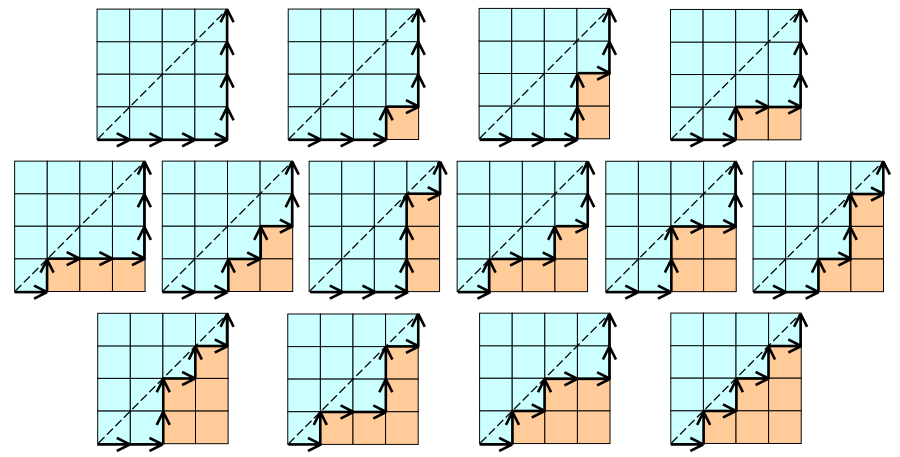
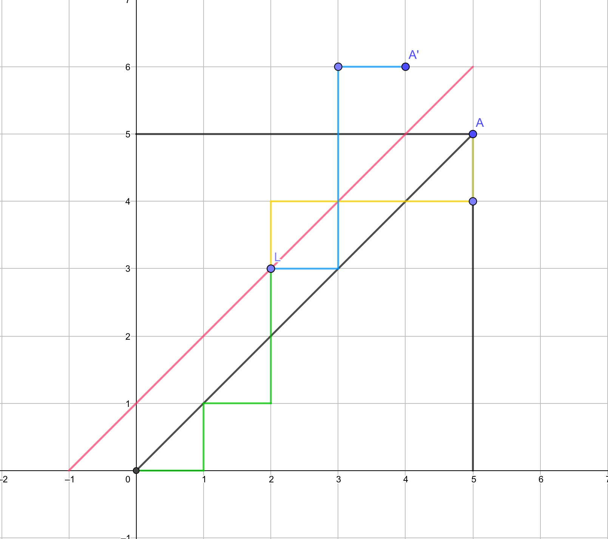

# 卡特兰数

## 卡特兰数的意义

卡特兰数有一个很重要的意义就是：
$C_n$表示所有在**n × n**格点中**不越过对角线的单调路径**的个数。

## 通项公式

卡特兰数有两个通项公式，第一个是这样的：
$$
C_{n}=\frac{1}{n+1}\left(\begin{array}{c}{2 n} \\ {n}\end{array}\right)=\frac{(2 n) !}{(n+1) ! n !}
$$
第二个是这样的：
$$
C_{n}=\left(\begin{array}{c}{2 n} \\ {n}\end{array}\right)-\left(\begin{array}{c}{2 n} \\ {n+1}\end{array}\right) \quad \text { for } n \geq 1
$$
第一个公式就是把第二个公式拆开。

## 卡特兰数通项公式的证明
我们考虑证明第二个公式。证明的方式有很多，均和卡特兰数的性质有关，证明方法之间也可以互相转换。所以这里介绍一种最普通的证明方法。

根据定义，合法的路径不能越过对角线。那么我们考虑利用总方案数$C_{2n}^n$减去不合法的方案数。

这里的黄色线和绿色线连接而成的路径代表一条不合法的路径，我们把路径**第一次**超越对角线的点（点L）到终点（点A）的路径沿粉色线条（对角线向上平移1个单位得到）对称。得到了蓝色的路径。显然，这里的黄色路径和蓝色路径是对应的。

容易证明，所有不合法的路径和所有从原点到A'点的路径都是一一对应的。所以不合法的路径条数就是从原点到A'的路径条数$C_{2n}^{n-1}$

这样就得出了前面提到的卡特兰数第二个通项公式：

$$
C_{n}=\left(\begin{array}{c}{2 n} \\ {n}\end{array}\right)-\left(\begin{array}{c}{2 n} \\ {n+1}\end{array}\right) \quad \text { for } n \geq 1
$$

## 应用

>  组合数学中有非常多的组合结构可以用卡塔兰数来计数。

- $C_n$表示长度*2n*的dyck word的个数。Dyck word是一个有*n*个X和*n*个Y组成的字串，且所有的前缀字串皆满足X的个数大于等于Y的个数。以下为长度为6的dyck words: XXXYYY XYXXYY XYXYXY XXYYXY XXYXYY。（这个性质在[ZROI1151](http://www.zhengruioi.com/problem/1151)用到了）
- 将上例的X换成左括号，Y换成右括号，$C_n$表示所有包含*n*组括号的合法运算式的个数。
- $C_n$表示有*n*个节点组成不同构的二叉树方案数。下图中，*n*等于*3*，圆形表示节点，月牙形表示什么都没有。（不同构二叉树是指：对于两颗二叉树每个节点，他们的左儿子和右儿子完全相等）
- $C_n$表示有*2n+1*个节点组成不同构"合并果子树"（full binary tree）的方案数。下图中，*n*等于*3*，圆形表示内部节点，月牙形表示外部节点。本质同上。

- $C_n$表示通过连结顶点而将*n* + 2边的凸多边形分成三角形的方法个数。
- $C_n$表示集合$\{1,...,n\}$依次入栈后合法的出栈顺序方案数。

## 参考资料

[维基百科-卡特兰数](https://zh.wikipedia.org/wiki/%E5%8D%A1%E5%A1%94%E5%85%B0%E6%95%B0)