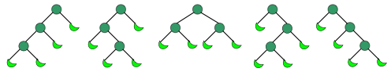

# 数学基础

## 筛法

### 埃氏筛

复杂度$O(n\log\log n)$

[过水已隐藏]

### 线性筛

```cpp
bool flag[maxn];
int prime[maxn];
void init() {
    flag[1]=1;
    for(int i=2;i<=maxn;i++) {
        if(!flag[i])prime[++tot]=i;
        for(int j=1;j<=tot&&prime[j]*i<=maxn;j++) {
            flag[prime[j]*i]=1;
            if(i%prime[j]==0)break;
        }
    }
}
```

线性筛可以用于所有的积性函数。

真正的精华在于```if(i%prime[j]==0)break;```这句话

线性筛每一个元素只能被其最小质因子筛一次。可以证明，如果```i%prime[j]==0```，那么$[prime[j+1],prime[tot]]$都不是$[prime[j+1]*i,prime[tot]*i]$的最小质因子。那么就直接``break```。

证明：

当```i%prime[j]==0```，那么$i$可以写成$prime[j]*k$。所以对于下一个被筛的数$prime[j+1]*i$，可以把它化成$prime[j]*k*prime[j+1]$。

但请注意，根据线性筛的定义，每一个元素只能被其最小质因子筛一次。所以$prime[j+1]*i$这个数不应该被$prime[j+1]$筛，而是应该被$prime[j]$筛。后面的质数也同理。

## 最大公约数

### 更相减损

$gcd(a,b)=gcd(a-b,b)$

证明：咕咕咕

### 欧几里得

只需要在更相减损的基础上把减法优化成取模即可：

$gcd(a,b)=gcd(b,a\%b)$

## 裴蜀定理和exgcd（扩展欧几里得）

首先，有个神奇的东西叫裴蜀等式/裴蜀定理。

这里有一个不定方程：$ax+by=m$。

裴蜀定理就是如果上面这个不定方程有解当且仅当$gcd(a,b)|m$。且当这个不定方程有解时，一定有无数多组解。

证明：（咕咕咕）

对于方程：$ax+by=gcd(a,b)$，我们可以用exgcd算法找到这个式子的一组解，然后就能就能推出$ax+by=m$的解。

而$ax+by=gcd(a,b)$可以通过递归构造解来解决：
$$
a  \bmod b=a-\left \lfloor \frac{a}{b} \right \rfloor b
\\假设存在x',y'使得x'b+y'(a \bmod b)=d
\\则x'b+y'(a-\left \lfloor \frac{a}{b} \right \rfloor b)=d
\\把上面这个式子化成ay'+b(x'-y'\left \lfloor \frac{a}{b} \right \rfloor)
\\然后我们可以从这一层推出上一层的解x=y',y=(x'-y'\left \lfloor \frac{a}{b} \right \rfloor)
$$
特别的，当g欧几里得算法递归到最低一层时，是这个样子的：$gcd(c,d),d=0$

那么对于这种情况我们就可直接得出当前这一层对应的不定方程$cx''+dy''=gcd(c,d)=c$的解：$x''=1,y''=0$然后就可以倒推出上一层的解。

当我们知道一组特解$x0,y0$之后，我们可以推出这个方程的通解：$x=x0+\frac {b}{d}*k,y=y0-\frac {a}{d}*k$其中$d=gcd(a,b)$。 至于这个式子是怎么来的，我们可以把式子变成$ax+by+\frac{ab}{d}-\frac{ab}{d}=d$然后提一下公因式就好了。另外，为什么ab要除d而不是其他数字是因为$d=gcd(a,b)$。

至此，我们只求出了$ax+by=gcd(a,b)$的通解。

我们只需要在两边乘上$\frac {m}{gcd(a,b)}$即可，因为这里不变的是系数（x0,y0均乘上这个式子，$a$和$b$不变），所以依旧可以用前面的方法求出特解。

如果遇到求出最小的正整数$x$，我们可以设$p=\frac{b}{d} $，而我们需要的最小正整数x就是:

$(x0\bmod p+p)\bmod p$

代码(引自[KSKUN——欧几里得算法和扩展欧几里得算法](<https://ksmeow.moe/euclid/>))：

```cpp
int exgcd(int a, int b, int &x, int &y) {
    if(b == 0) {
        x = 1; // 设置b=0时的特殊解 
        y = 0;
        return a;
    }
    int ans = exgcd(b, a % b, x, y);
    int t = x; // 将x2, y2换算成x1, y1
    x = y;
    y = t - a / b * y;
    return ans;
}
```

## 线性同余方程

形如$ax \equiv c\pmod b$的式子我们称之为一元线性同余方程。

至于这个式子的求解，我们可以先把它化成$ax+by=c$的形式，其中$y<0$。就可以按照不定方程的做法做了。


## 欧拉函数

### 欧拉函数的性质

#### 性质1-欧拉定理和扩展欧拉定理

欧拉定理：

当$gcd(a,p)=1$时，
$$
a^{\phi{p}}\equiv1 \pmod p
$$
扩展欧拉定理：
$$
a^b\equiv
\begin{cases}
a^{b\%\phi(p)}~~~~~~~~~~~gcd(a,p)=1\\
a^b~~~~~~~~~~~~~~~~~~gcd(a,p)\neq1,b<\phi(p)\\
a^{b\%\phi(p)+\phi(p)}~~~~gcd(a,p)\neq1,b\geq\phi(p)
\end{cases}~~~~~~~(mod~p)
$$

#### 性质2-积性函数

$\textrm{当$a,b$互质时 },\phi(a) \times \phi(b)=\phi (ab)$

#### 性质3-欧拉函数特有性质

1. $\textrm {when $p\mid n$},\phi(np)=\phi(n)*p$

   证明：

   令$\prod _{p_i\mid np,\textrm { $p_i$ is prime}} (1-\frac{1}{p_i})=A$

   $\phi(np)=np*A,\phi (n)=n*A$

   显然，$\phi(np)=\phi(n)*p$

   得证

2. 当$p$为$n$的一个质因数，$if\ \ p^2|n\ \ then\ \ \varphi(n)=\varphi(\frac{n}{p})*p\ \ else\ \ \varphi(n)=\varphi(\frac{n}{p})*\varphi(p)$

   由上一个性质和积性函数性质，很容易可以证明

### 欧拉函数的求解

咕咕咕

先贴个$O(\sqrt n)$的求欧拉函数板子吧。

代码：

```cpp
inline int getphi(int x) {
    int tmp = sqrt(x), res = x;
    for (int i = 1; i <= tmp; i++) {
        if (x % i == 0) {
            res -= res / i;
            while (x % i == 0) x /= i;
		}
	}
    return x > 1 ? res - res / x : res;
}
```

当然，我们也可以用埃氏筛的思路来筛$[1,n]$的欧拉函数。

代码：

```cpp
inline int getphi(int x){
    for(int i=2;i<=x;i++){
      	if(phi[i])continue;
        for(int j=i;j<=x;j+=i){
            if(!phi[j])phi[j]=j;
            phi[j]=phi[j]/i*(i-1);
        }
    }
    return 0;
}
```


## 等比数列

### 求和

$\sum _{i=1}^n a_i$称为等比级数，记为$S_i$。

求和公式$S_n=\frac{a_1q^n-a_1}{q-1}$其中$q=\frac{a_n}{a_{n-1}}$。

证明：咕咕咕

## 逆元(*inverse* element)

## 组合数学

### 排列与组合基础

#### 排列数

从 $n$ 个不同元素中，任取 $m$ （ $m\leq n$ ， $m$ 与 $n$ 均为自然数，下同）个元素按照一定的顺序排成一列，叫做从 $n$ 个不同元素中取出 $m$ 个元素的一个排列；从 $n$ 个不同元素中取出 $m$ ( $m\leq n$ ) 个元素的所有排列的个数，叫做从 $n$ 个不同元素中取出 $m$ 个元素的排列数，用符号 $\mathrm A_n^m$ （或者是 $\mathrm P_n^m$ ）表示。

排列的计算公式如下：

$$
\mathrm A_n^m = n(n-1)(n-2) \cdots (n-m+1) = \frac{n!}{(n - m)!}
$$

 $n!$ 代表 $n$ 的阶乘，即 $6! = 1 \times 2 \times 3 \times 4 \times 5 \times 6$ 。

公式可以这样理解： $n$ 个人选 $m$ 个来排队 ( $m \le n$ )。第一个位置可以选 $n$ 个，第二位置可以选 $n-1$ 个，以此类推，第 $m$ 个（最后一个）可以选 $n-m+1$ 个，得：

$$
\mathrm A_n^m = n(n-1)(n-2) \cdots (n-m+1) = \frac{n!}{(n - m)!}
$$

全排列： $n$ 个人全部来排队，队长为 $n$ 。第一个位置可以选 $n$ 个，第二位置可以选 $n-1$ 个，以此类推得：

$$
\mathrm A_n^n = n(n-1)(n-2) \cdots 3 × 2 × 1 = n!
$$

全排列是排列数的一个特殊情况。

#### 组合数

从 $n$ 个不同元素中，任取 $m$ ( $m\leq n$ ) 个元素组成一个集合，叫做从 $n$ 个不同元素中取出 $m$ 个元素的一个组合；从 $n$ 个不同元素中取出 $m$ ( $m\leq n$ ) 个元素的所有组合的个数，叫做从 $n$ 个不同元素中取出 $m$ 个元素的组合数。用符号 $\mathrm C_n^m$ 来表示。

组合数计算公式

$$
\mathrm C_n^m = \frac{\mathrm A_n^m}{m!} = \frac{n!}{m!(n - m)!}
$$

如何理解上述公式？我们考虑 $n$ 个人 $m$ ( $m \le n$ ) 个出来，不排队，不在乎顺序 $C_n^m$ 。如果在乎排列那么就是 $A_n^m$ ，如果不在乎那么就要除掉重复，那么重复了多少？同样选出的来的 $m$ 个人，他们还要“全排”得 $A_n^m$ ，所以得：

$$
\mathrm C_n^m \times m! = \mathrm A_n^m\\
\mathrm C_n^m = \frac{\mathrm A_n^m}{m!} = \frac{n!}{m!(n-m)!}
$$

组合数也常用 $\displaystyle \binom{n}{m}$ 表示，读作「 $n$ 选 $m$ 」，即 $\displaystyle \mathrm C_n^m=\binom{n}{m}$ 。实际上，后者表意清晰明了，美观简洁，因此现在数学界普遍采用 $\displaystyle \binom{n}{m}$ 的记号而非 $\mathrm C_n^m$ 。

组合数也被称为「二项式系数」，下文二项式定理将会阐述其中的联系。

特别地，规定当 $m>n$ 时， $\mathrm A_n^m=\mathrm C_n^m=0$ 。

### 插板法

插板法一般用于求解将$n$个**相同**球放入$r$个**不相同**盒子的方案数。

#### 例子

现在有10个球，要放进3个盒子里
●●●●●●●●●●
隔2个板子，把10个球被隔开成3个部分
●|●|●●●●●●●●、●|●●|●●●●●●●、●|●●●|●●●●●●、●|●●●●|●●●●●、●|●●●●●|●●●●、●|●●●●●●|●●●、......
如此类推，10个球放进3个盒子的方法总数为${\binom  {10-1}{3-1}}={\binom  {9}{2}}=36$

n个球放进k个盒子的方法总数为${\binom  {n-1}{k-1}}$

问题等价于求$x_{1}+x_{2}+...+x_{k}=n$的可行解数，其中$x_{1},x_{2},...,x_{k}$为[正整数](https://zh.wikipedia.org/wiki/正整数)。

#### 空盒子推广

现在有10个球，要放进3个盒子里，并允许空盒子。考虑10+3个球的情况：

●|●|●●●●●●●●●●●、●|●●|●●●●●●●●●●、●|●●●|●●●●●●●●●、●|●●●●|●●●●●●●●、●|●●●●●|●●●●●●●、......

每个盒子的球都被拿走一个，得到一种情况，如此类推：

||●●●●●●●●●●、|●|●●●●●●●●●、|●●|●●●●●●●●、|●●●|●●●●●●●、|●●●●|●●●●●●、......

n个球放进k个盒子的方法总数（允许空盒子），等同于n+k个球放进k个盒子的方法总数（不允许空盒子），即${\binom  {n+k-1}{k-1}}$

问题等价于求$x_{1}+x_{2}+...+x_{k}=n$的可行解数，其中$x_{1},x_{2},...,x_{k}$为[非负整数](https://zh.wikipedia.org/wiki/非负整数)。

${\binom  {n+k-1}{k-1}}$也是$(a_{1}+a_{2}+...+a_{k})^{n}$展开式的项数$\sum _{{n_{1}+n_{2}+...+n_{k}=n}}1$

### 魔改插板法

如果我们需要求解将$n$个**不相同**球放入$r$个**相同**盒子的方案数。


## 费马平方和定理

费马平方和定理的表述是：[奇素数](https://zh.wikipedia.org/wiki/奇质数)能表示为两个[平方数](https://zh.wikipedia.org/wiki/平方数)之和的[充分必要条件](https://zh.wikipedia.org/wiki/充分必要条件)是该[素数](https://zh.wikipedia.org/wiki/素数)被4除余1。[证明]([https://zh.wikipedia.org/wiki/%E8%B4%B9%E9%A9%AC%E5%B9%B3%E6%96%B9%E5%92%8C%E5%AE%9A%E7%90%86](https://zh.wikipedia.org/wiki/费马平方和定理))

## 底和顶

我们可以用这个这个技巧完成向下取整/向上取整的转换：
$$
\begin{array}{l}{x \geq n \Leftrightarrow \lfloor x \rfloor \geq n} \\ {x>n \Leftrightarrow\lceil x\rceil> n} \\ {x \leq n \Leftrightarrow\lceil x\rceil \leq n} \\ {x<n \Leftrightarrow\lfloor x\rfloor< n}\end{array}
$$

## 一些trick

- $[1,n!]$中有多少个数能被$p$整除，可以直接用$\sum _{i=1} \left \lfloor \frac{n}{p^i} \right \rfloor$来求解。
- $\sum _{i=1}^n i^2=\frac {n*(n+1)*(2n+1)/6}{6}$
- $\text{when } p \text{ is prime},a^b \bmod p=a^{b \bmod p-1}\bmod p$（使用欧拉定理推导）
- 如果要求解$\left \lfloor \frac{a}{d} \right \rfloor$其中d每次变化1，那么显然可以数论分块，当$l=d$，那么$r=\frac{a}{\frac{a}{d}}$。可以证明一共有$\sqrt {n}$种取值。

## 矩阵乘法

对于两个矩阵$A$和$B$相乘，得到的矩阵$C$的列数与$A$相等，行数与$B$相等。同时要求$A$的行数和$B$的列数相等。

如果令$A的行数=B的列数=n$那么$C_{i,j}=\sum_{k=1}^{n} A_{k,j}*B_{i,k}$。

## 卡特兰数

### 通项公式

卡特兰数有两个通项公式，第一个是这样的：
$$
C_{n}=\frac{1}{n+1}\left(\begin{array}{c}{2 n} \\ {n}\end{array}\right)=\frac{(2 n) !}{(n+1) ! n !}
$$
第二个是这样的：
$$
C_{n}=\left(\begin{array}{c}{2 n} \\ {n}\end{array}\right)-\left(\begin{array}{c}{2 n} \\ {n+1}\end{array}\right) \quad \text { for } n \geq 1
$$

### 应用

>  组合数学中有非常多的组合结构可以用卡塔兰数来计数。

- $C_n$表示长度*2n*的dyck word的个数。Dyck word是一个有*n*个X和*n*个Y组成的字串，且所有的前缀字串皆满足X的个数大于等于Y的个数。以下为长度为6的dyck words: XXXYYY XYXXYY XYXYXY XXYYXY XXYXYY。（这个性质在[ZROI1151](http://www.zhengruioi.com/problem/1151)用到了）
- 将上例的X换成左括号，Y换成右括号，$C_n$表示所有包含*n*组括号的合法运算式的个数。
- $C_n$表示有*n*个节点组成不同构的二叉树方案数。下图中，*n*等于*3*，圆形表示节点，月牙形表示什么都没有。（不同构二叉树是指：对于两颗二叉树每个节点，他们的左儿子和右儿子完全相等）
- $C_n$表示有*2n+1*个节点组成不同构"合并果子树"（full binary tree）的方案数。下图中，*n*等于*3*，圆形表示内部节点，月牙形表示外部节点。本质同上。




## 斯特林数

### 第一类斯特林数（Stirling Number）

设有多项式 $x(x-1)(x-2) \cdots (x-n+1)$ ，它的展开式形如 $s_nx^n - s_{n-1}x^{n-1}+s_{n-2}x^{n-2}-\cdots$ 。

不考虑各项系数的符号，将 $x^r$ 的系数的绝对值记做 $s(n, r)$ ，称为第一类 Stirling 数。

 $s(n, r)$ 也是把 $n$ 个不同的球排成 $r$ 个非空循环排列的方法数。

关于第一类斯特林数的性质可以阅读 [Stirling Number of the First Kind](http://mathworld.wolfram.com/StirlingNumberoftheFirstKind.html) 。

#### 递推形式

$$
s(n,r) = (n-1)s(n-1,r)+s(n-1,r-1),\ n > r \geq 1
$$

考虑最后一个球，它可以单独构成一个非空循环排列，也可以插入到前面的某一个球的一侧。

若单独放，则有 $s(n-1,r-1)$ 种放法；若放在某个球的一侧，则有 $(n-1)s(n-1,r)$ 种放法。

### 第二类斯特林数（Stirling Number）

把 $n$ 个不同的球放到 $r$ 个相同的盒子里，假设没有空盒，则放球方案数记做 $S(n, r)$ ，称为第二类 Stirling 数。

关于第二类斯特林数的性质可以阅读 [Stirling Number of the Second Kind](http://mathworld.wolfram.com/StirlingNumberoftheSecondKind.html) 。

#### 递推形式

$$
S(n,r) = r S(n-1,r) + S(n-1,r-1),\ n > r \geq 1
$$

考虑最后一个球，若它单独放一个盒子，有 $S(n-1,r-1)$ 种放法；若是和前面的某一个球放在同一个盒子里，则有 $r S(n-1,r)$ 种放法。

## 参考资料

[斯特林数](https://oi-wiki.org/math/stirling/)

[隔板法](https://zh.wikipedia.org/wiki/%E9%9A%94%E6%9D%BF%E6%B3%95)

[排列组合](https://oi-wiki.org/math/combination/#_4)