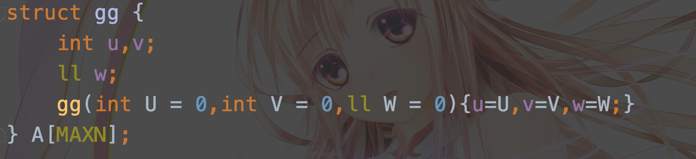

# 语法上的小trick

## 构造函数

虽然不写构造函数也是可以的，但是可能会开翻车，所以还是写上吧。：

提供三种写法：


​	使用的时候只用：




注意，这里的```A[i]=gg(3,3,3)```的“gg”不能打括号，否则就是强制转换了。

## 快速读入

```cpp
inline char nc(){
    static char buf[100000],*p1=buf,*p2=buf;
    return p1==p2&&(p2=(p1=buf)+fread(buf,1,100000,stdin),p1==p2)?EOF:*p1++;
}
inline int _read(){
    char ch=nc();int sum=0;
    while(!(ch>='0'&&ch<='9'))ch=nc();
    while(ch>='0'&&ch<='9')sum=sum*10+ch-48,ch=nc();
    return sum;
}
```

`_read()`函数返回的就是读入信息。

## 迭代器

对于一个迭代器`it`，那么它代表了一个内存位置，我们可以用`*it`得到它代表的值。

对于一些STL，我们可以遍历其中元素。以`set`为例：

```cpp
int a[] = {1,2,3};
set<int> s;
set<int>::iterator it;
s.insert(a,a+3);
for(it=s.begin();it!= s.end() ; ++it)cout<<*it<<" ";
```

## 参考资料

[C++中set用法详解](https://blog.csdn.net/yas12345678/article/details/52601454)