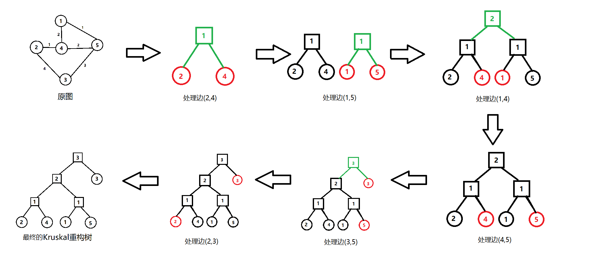

# [算法模板]Kruskal重构树

kruskal重构树是一个很常用的图论算法。主要用于解决**u->v所有路径上最长边的最小值**，就是找到$u->v$的一条路径，使路径上的最长边最小。

图片来自[Kruskal重构树学习笔记+BZOJ3732 Network](<https://www.cnblogs.com/1000Suns/p/9360558.html>)


从上图我们可以看出，kruskal重构树有以下特质：

- 每个原图上的节点一一对应重构树上的叶子节点。
- 重构树上每一个其他节点（正方形）代表原图上的一个边，有点权。
- 重构树是一棵二叉树。
- 重构树是一个二叉堆。（所以两个叶子节点的LCA即为路径上的最大边）

那如何建树呢？显然，在kruskal基础上搞一搞就行了：



```cpp
#include<iostream>
#include<cstdio>
#include<algorithm>
#include<vector>
using namespace std;
#define maxn 25000
struct gg{
    int u,v,w;
}side1[maxn*2];
vector<int> side2[maxn*4];
bool cop(gg x,gg y){return x.w<y.w;}
int ncnt,num[maxn*4],n,m,k,head[maxn],cnt,dep[maxn*4],f[maxn*4][21],fa[maxn*4];
int get(int x){
    if(fa[x]==x)return x;
    fa[x]=get(fa[x]);
    return fa[x];
}
void uni(int x,int y,int w){
    int gx=get(x),gy=get(y);
    if(gx==gy)return;
    ncnt++;num[ncnt]=w;
    side2[ncnt].push_back(gx);side2[ncnt].push_back(gy);side2[gx].push_back(ncnt);side2[gy].push_back(ncnt);
    fa[gx]=fa[gy]=fa[ncnt]=ncnt;
    return;
}
void dfs(int u,int g){
    dep[u]=dep[g]+1;f[u][0]=g;
    for(int i=1;i<=20;i++)f[u][i]=f[f[u][i-1]][i-1];
    for(int i=0;i<(int)side2[u].size();i++){
        int v=side2[u][i];if(v==g)continue;
        dfs(v,u);
    }
    return;
}
int lca(int u,int v){
    if(dep[u]<dep[v])swap(u,v);
    for(int i=20;i>=0;i--)if(dep[f[u][i]]>=dep[v])u=f[u][i];
    if(u==v)return u;
    for(int i=20;i>=0;i--)if(f[u][i]!=f[v][i]){u=f[u][i];v=f[v][i];}
    return f[u][0];
}
int main(){
    scanf("%d%d%d",&n,&m,&k);
    for(int i=1;i<=m;i++){
        int u,v,w;scanf("%d%d%d",&u,&v,&w);
        side1[i]=(gg){u,v,w};
    }
    for(int i=0;i<=n;i++){fa[i]=i;}
    ncnt=n;
    sort(side1+1,side1+1+m,cop);    
    for(int i=1;i<=m;i++){
        if(get(side1[i].u)==get(side1[i].v))continue;
        uni(get(side1[i].u),get(side1[i].v),side1[i].w);
    }
    dfs(ncnt,0);
    for(int i=1;i<=k;i++){
        int a,b;scanf("%d%d",&a,&b);
        printf("%d\n",num[lca(a,b)]);
    }
    return 0;
}
```

