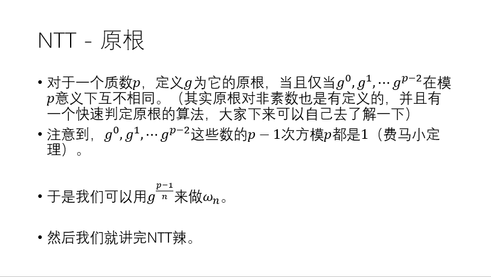

# [算法模板]FFT-快速傅里叶变换

感谢[ZYW](https://blog.csdn.net/weixin_45313881)聚聚为我们讲解FFT~

## FFT

### 思路

我懒，思路和证明部分直接贴链接：

[rvalue](https://www.cnblogs.com/rvalue/p/7351400.html)

[LSJ-FFT与NTT基础](https://0x131cc05.github.io/2019/03/11/FFT%E4%B8%8ENTT%E5%9F%BA%E7%A1%80/)

### 代码

主要思想是利用了单位根特殊的性质（n次单位根后一半幂跟前一半幂取值相等）。只是因为式子中奇数次幂还要提出来个$\omega_n^k$，这个东西只要取个反就好了（即对称性：$\omega_n^k=-\omega_n^{k+\frac{n}{2}}$）。

FFT递归：

```cpp
#include <cstdio>
#include <cmath>
using namespace std;
const int maxn=2e6+10;
const double pi=acos(-1.0);
struct comp{
	double a,b;
};
comp operator +(comp a,comp b){return (comp){a.a+b.a,a.b+b.b};}
comp operator -(comp a,comp b){return (comp){a.a-b.a,a.b-b.b};}
comp operator *(comp a,comp b){return (comp){a.a*b.a-a.b*b.b,a.a*b.b+a.b*b.a};}
void fft(int l,comp *a,int f)
{
	if(l==1) return;
	comp a1[l>>1],a2[l>>1];
	for(int i=0;i<l;i+=2)
	{
		a1[i>>1]=a[i];
		a2[i>>1]=a[i+1];
	}
	fft(l>>1,a1,f); fft(l>>1,a2,f);
	comp wn=(comp){cos(2*pi/l),f*sin(2*pi/l)},w=(comp){1,0};
	for(int i=0;i<(l>>1);i++,w=w*wn)
	{
		a[i]=a1[i]+w*a2[i];
		a[i+(l>>1)]=a1[i]-w*a2[i];
	}
}
comp a[maxn],b[maxn];
int main ()
{
	int n,m; scanf("%d%d",&n,&m);
	for(int i=0;i<=n;i++) scanf("%lf",&a[i].a);
	for(int i=0;i<=m;i++) scanf("%lf",&b[i].a);
	int l=1; while(l<=n+m) l<<=1;
	fft(l,a,1); fft(l,b,1);
	for(int i=0;i<l;i++) a[i]=a[i]*b[i];
	fft(l,a,-1);
	for(int i=0;i<=n+m;i++) printf("%d ",(int)(a[i].a/l+0.5));
	return 0;
}
```

因为其运行效率过低。我们一般使用迭代FFT。

FFT迭代：

```cpp
#include <cstdio>
#include <cmath>
#include <iostream> 
using namespace std;
const int maxn=4*1e6+10;
const double pi=acos(-1.0);
struct comp{
	double a,b;
};
comp operator +(comp a,comp b){return (comp){a.a+b.a,a.b+b.b};}
comp operator -(comp a,comp b){return (comp){a.a-b.a,a.b-b.b};}
comp operator *(comp a,comp b){return (comp){a.a*b.a-a.b*b.b,a.a*b.b+a.b*b.a};}
int rev[maxn],rp;
void get_rev(int l)//l为位数,rev[i]代表i的二进制表示颠倒（二进制位有l位，不足补0） 
{
	for(int i=1;i<(1<<l);i++)
	rev[i]=(rev[i>>1]>>1)|((1&i)<<l-1);
}
void fft(int len,comp *a,int f)
{
	for(int i=1;i<len;i++)
	if(rev[i]>i) swap(a[rev[i]],a[i]);
	for(int l=2;l<=len;l<<=1)//区间长度 
	{
		comp wn=(comp){cos(2*pi/l),f*sin(2*pi/l)};	
		for(int i=0;i+l<=len;i+=l)
		{
			comp w=(comp){1,0};
			for(int k=i;k<i+(l>>1);k++,w=w*wn)
			{
				comp t=w*a[k+(l>>1)],tmp=a[k];
				a[k]=tmp+t;
				a[k+(l>>1)]=tmp-t;
			}
		}
	}			 
}
//a[i]表示当x=单位根的i次方时y的值 
comp a[maxn],b[maxn];
int main ()
{
	int n,m; scanf("%d%d",&n,&m);
	for(int i=0;i<=n;i++) scanf("%lf",&a[i].a);
	for(int i=0;i<=m;i++) scanf("%lf",&b[i].a);
	int l=1,cnt=0; while(l<=n+m) l<<=1,cnt++;
	get_rev(cnt);
	fft(l,a,1); fft(l,b,1);//l是多项式项数
	for(int i=0;i<l;i++) a[i]=a[i]*b[i];
	fft(l,a,-1);
	for(int i=0;i<=n+m;i++) printf("%d ",(int)(a[i].a/l+0.5));
	return 0;
}
```

## NTT

> 啊我饿了我要吃NTT

直接粘一张钟神的PPT：




### 代码

预处理原根次幂：

```cpp
for(int i=2;i<(1<<l);i<<=1) {//枚举单位根周期长度(即w_n的n)
		int w0=Pow(3,(P-1)/i),w1=Pow(3,P-1-(P-1)/i);
		wn[0][i>>1]=wn[1][i>>1]=1;//wn[f][i],i的最高位代表是几次单位根，其他位代表是第几个。这里求的是i的单位根，因为前一半i单位根等于i/2的单位根所以是存储在i/2的位置.(推式子的时候推过,长度为len时代入单位根周期为len/2)
		for(int j=1;j<(i>>1);++j)//w_i单位根的j次方(因为折半了所以只用求一半)
			wn[0][(i>>1)+j]=wn[0][(i>>1)+j-1]*(ll)w0%P,
			wn[1][(i>>1)+j]=wn[1][(i>>1)+j-1]*(ll)w1%P;
}
```


[[模板]分治FFT](https://www.luogu.com.cn/problem/P4721)

```cpp
#include<iostream>
#include<cstdio>
#include<algorithm>
#include<cstring>
#include<cmath>
using namespace std;
const int mod=998244353;
const int maxn=3e5+10;
typedef long long ll;
ll a[maxn],b[maxn],f[maxn],g[maxn],wn[2][maxn];
int n,rev[maxn];
int ksm(int num,int t){
	int res=1;
	for(;t;t>>=1,num=1ll*num*num%mod){
		if(t&1)res=1ll*res*num%mod;
	}
	return res;
}
void get_rev(int len){for(int i=1;i<(1<<len);i++)rev[i]=(rev[i>>1]>>1)|((i&1)<<(len-1));}
void get_wn(int len){
	for(int i=2;i<=(1<<len);i<<=1){
		ll w1=ksm(3,(mod-1)/i),w0=ksm(3,mod-1-(mod-1)/i);
		wn[0][i>>1]=wn[1][i>>1]=1;
		for(int j=1;j<(i>>1);j++){
			wn[0][j+(i>>1)]=wn[0][j+(i>>1)-1]*w0%mod;	
			wn[1][j+(i>>1)]=wn[1][j+(i>>1)-1]*w1%mod;	
		}
	}
}
void NTT(int len,ll *c,int f){
	for(int i=0;i<len;i++)if(rev[i]>i)swap(c[i],c[rev[i]]);
	for(int l=2;l<=len;l<<=1){
		for(int i=0;i+l<=len;i+=l){
			for(int k=i;k<i+(l>>1);k++){
				ll tmp1=c[k],tmp2=wn[f][k+(l>>1)-i]*c[k+(l>>1)];
				c[k]=(tmp1+tmp2)%mod;
				c[k+(l>>1)]=(tmp1-tmp2+mod)%mod;	
			}
		}
	}
}
void cdq(int l,int r){
	if(l==r)return;
	int mid=(l+r)>>1;
	cdq(l,mid);
	int cnt=0,len=1;while(len<=(r-l-1))len<<=1,cnt++;
	for(int i=0;i<len;i++)a[i]=b[i]=0;
	for(int i=0;i<=mid-l;i++)a[i]=f[i+l];	
	for(int i=0;i<=r-l-1;i++)b[i]=g[i+1];
//	memset(rev,0,sizeof(rev));
	get_rev(cnt);
	NTT(len,a,1);NTT(len,b,1);
	for(int i=0;i<len;i++)a[i]=a[i]*b[i]%mod;
	NTT(len,a,0);
	ll inv=ksm(len,mod-2);
	for(int i=0;i<len;i++)a[i]=a[i]*inv%mod;
	for(int i=mid+1;i<=r;i++)f[i]+=a[i-l-1],f[i]%=mod;
	cdq(mid+1,r);
}
int main(){
	f[0]=1;
	scanf("%d",&n);get_wn(18);
	for(int i=1;i<n;i++)scanf("%lld",&g[i]);
	cdq(0,n-1);
	for(int i=0;i<n;i++)printf("%lld ",(f[i]%mod+mod)%mod);
	return 0;
}

```