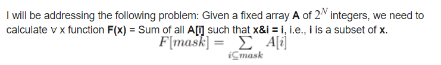
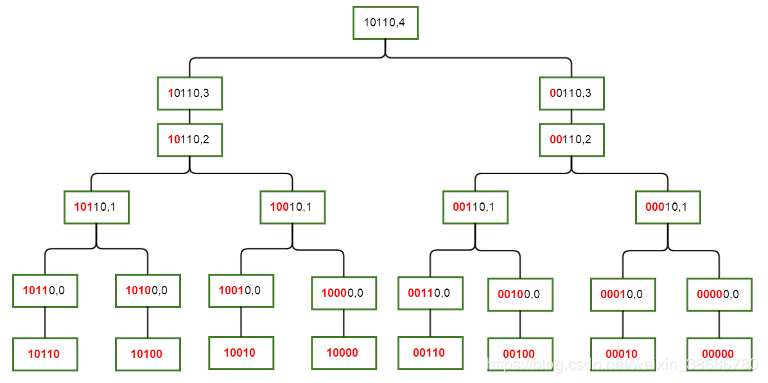

# [算法模板]SOS DP

## 正文

SOS-DP（$\text{Sum over Subsets}$）是用来解决这样的问题的：



其实就是子集和DP。上面每个$F[mask]$里面包含了$mask$所有二进制子集的信息。这是一种$n\log_2 n$的DP方法。

我们定义一个DP状态$S(mask,i)$代表$mask$子集中只有最靠右的$i$位与其不同的状态。

具体是这样的：



图中描述了$S(10110,4)$这个状态和其所有儿子之间的关系。

形象一些解释就是每次我们求解一个状态时，我们只从他的所有子集里和他只差一位的状态转移过来。（众所周知，如果$A\subseteq B,B\subseteq C$那么$A\subseteq$ C）。

放一段代码：

```cpp
for(int i = 0; i<(1<<N); ++i)
	F[i] = A[i];
for(int i = 0;i < N; ++i) for(int mask = 0; mask < (1<<N); ++mask){
	if(mask & (1<<i))
		F[mask] += F[mask^(1<<i)];
}
```

所以显然，复杂度$N\space 2^N$。如果令值域为$M$，那么复杂度就是$M\log_2M$。

## 例题

[CF1208F Bits And Pieces](https://codeforces.com/contest/1208/problem/F)

[CF165E Compatible Numbers](https://codeforces.com/contest/165/problem/E)

[CF383E Vowels](https://codeforces.com/contest/383/problem/E)

## 参考资料

[SOS Dynamic Programming [Tutorial]](https://codeforces.com/blog/entry/45223)

[SOS DP](https://blog.csdn.net/weixin_38686780/article/details/100109753)