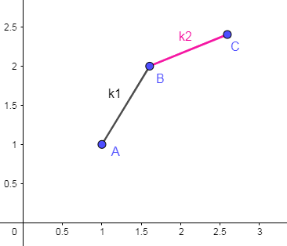
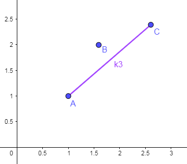
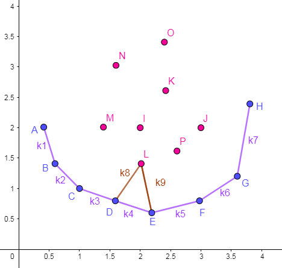
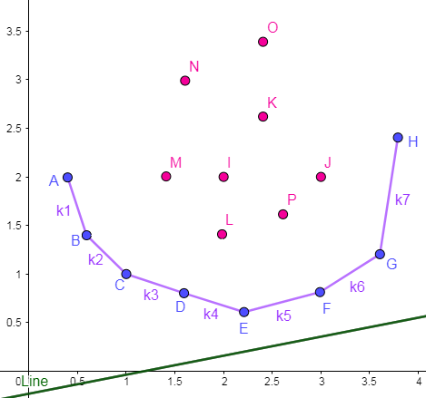
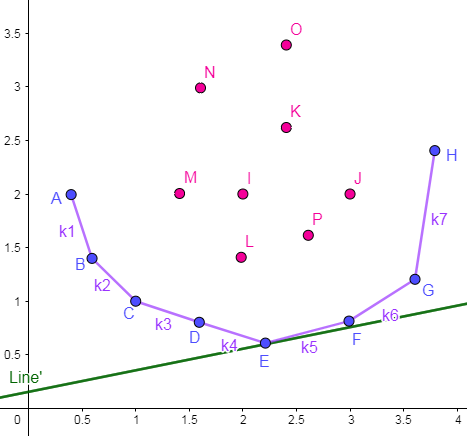
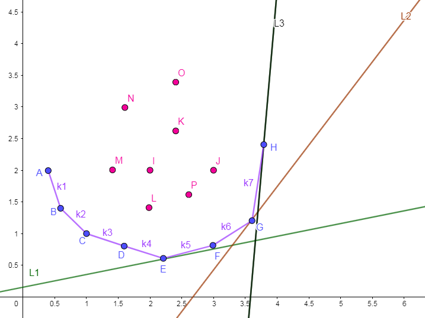

# **[算法模板]动态规划—斜率优化**

>### 本文全文引自[Xing-Ling](https://www.cnblogs.com/Xing-Ling/p/11210179.html)，感谢Xing-Ling提供markdown源码。

[【学习笔记】动态规划—各种 $\text{DP}$ 优化](https://www.cnblogs.com/Xing-Ling/p/11317315.html)

## **【前言】**

第一次写这么长的文章。

写完后感觉对斜优的理解又加深了一些。

斜优通常与决策单调性同时出现。可以说决策单调性是斜率优化的前提。

斜率优化 $DP$，顾名思义就是利用斜率相关性质对 $DP$ 进行优化。

斜率优化通常可以由两种方式来理解，需要灵活地运用数学上的**数形结合,线性规划**思想。

对于这样形式的 $dp$ 方程：$dp[i]=Min/Max(a[i]∗b[j]+c[j]+d[i])$，其中 $b$ 严格单调递增。

该方程的关键点在于 $a[i]*b[j]$ 这一项，它既有 $i$ 又有 $j$，于是单调队列优化不再适用，可以尝试使用斜率优化。

-------

## **一.【决策单调性证明】**

这里以 [玩具装箱 $toy$ $[P3195]$](https://www.luogu.org/problemnew/show/P3195) 为例，先来证一波决策单调性，方法采用**四边形不等式**。

设 $S[n]=\sum _{i=1}^n (C[i]+1)$，用 $dp[i]$ 表示装好前 $i$ 个的最小花费，则 $dp$ 方程为：$dp[i]=min(dp[j]+(S[i]−S[j]-1-L)^2)$。

很明显，这个方程以 $dp[i]=min(dp[j]+w(i,j))$ 的形式呈现，即 $1D/1D$ 动态规划方程，其中 $w(i,j)=(S[i]−S[j]-1-L)^2$。

$证明：设$ $Q=S[i]−S[j]-1-L$

$\therefore w(i,j)=(S[i]−S[j]-1-L)^2=Q^2$

$\begin{equation*}
\begin{split}
\therefore w(i+1,j+1)=&(S[i+1]−S[j+1]-1-L)^2\\
                   =&((S[i]+C[i+1]+1)−(S[j]+C[j+1]+1)-1-L)^2\\
                   =&(Q+C[i+1]-C[j+1])^2
\end{split}
\end{equation*}$

$\begin{equation*}
\begin{split}
w(i,j+1)=&(S[i]−S[j+1]-1-L)^2\\
                   =&(S[i]−(S[j]+C[j+1]+1)-1-L)^2\\
                   =&(Q-C[j+1]-1)^2
\end{split}
\end{equation*}$

$\begin{equation*}
\begin{split}
w(i+1,j)=&(S[i+1]−S[j]-1-L)^2\\
                   =&((S[i]+C[i+1]+1)−S[j]-1-L)^2\\
                   =&(Q+C[i+1]+1)^2
\end{split}
\end{equation*}$

$\therefore w(i,j)+w(i+1,j+1)=2X^2+2C[i+1]X-2C[j+1]X+C[i+1]^2-2C[i+1]C[j+1]+C[j+1]^2$

$\therefore w(i+1,j)+w(i,j+1)=2X^2+2C[i+1]X-2C[j+1]X+C[i+1]^2+2C[i+1]+2C[j+1]+C[j+1]^2+2$

$\therefore w(i,j)+w(i+1,j+1)-w(i+1,j)+w(i,j+1)=-2(C[i+1]+1)(C[j+1]+1)$

$又 \because C[i],C[j] \geqslant 1$

$\therefore -2(C[i+1]+1)(C[j+1]+1) \leqslant -8$

$\therefore w(i,j)+w(i+1,j+1) \leqslant w(i+1,j)+w(i,j+1)$

四边形不等式成立，所以次题具有决策单调性。

在实战中，通常使用打表的形式来判断是否满足四边形不等式。

---------

## **二.【理解方式】**

还是以 [玩具装箱 $toy$ $[P3195]$](https://www.luogu.org/problemnew/show/P3195) 为例，两种斜优的理解方式。

决策方程为：$dp[i]=min(dp[j]+(S[i]−S[j]-1-L)^2)$。
为方便描述，将 $L$ 提前加 $1$，再把 $min$ 去掉，得到状态转移方程：$dp[i]=dp[j]+(S[i]−S[j]-L)^2$。

化简得：$dp[i]=S[i]^2-2S[i]L+dp[j]+(S[j]+L)^2-2S[i]S[j]$

### **1.【代数法】**

-----

只含 $L$ 的项对于每一个 $i$ 的**择优筛选**过程都是完全一样的值，只含 $Function(i)$ 的项在一次 $i$ 的**择优筛选**过程中不变，含 $Function(j)$ 的项始终在发生变化（只要该项是**严格单增**）。
以此为划分依据，把同类型的项用括号括起来，
即：$dp[i]=(-2S[i]S[j])+(dp[j]+(S[j]+L)^2)+(S[i]^2-2S[i]L)$

-----

#### **【维护一个凸包】**

设 $j_1,j_2$ $(0 \leqslant j_1<j_2<i)$ 为 $i$ 的两个决策点，且满足**决策点 $j2$ 优于 $j1$**，
有：$(-2S[i]S[j_2])+(dp[j_2]+(S[j_2]+L)^2)+(S[i]^2-2S[i]L) \leqslant (-2S[i]S[j_1])+(dp[j_1]+(S[j_1]+L)^2)+(S[i]^2-2S[i]L)$

即：$(-2S[i]S[j_2])+(dp[j_2]+(S[j_2]+L)^2) \leqslant (-2S[i]S[j_1])+(dp[j_1]+(S[j_1]+L)^2)$

**划重点：此处移项需要遵循的原则是：参变分离。将 $Function(i)$ 视作未知量，用  $Function(j)$ 来表示出 $Function(i)$ 。**
移项得：$-2S[i](S[j_2]-S[j_1]) \leqslant (dp[j_1]+(S[j_1]+L)^2)-(dp[j_2]+(S[j_2]+L)^2)$

$\because C[j] \geqslant 1$
$\therefore S[j+1] > S[j]$
$又 \because j_2 > j_1$
$\therefore S[j_2]-S[j_1]>0$
$\therefore 2S[i] \geqslant \frac {(dp[j_2]+(S[j_2]+L)^2)-(dp[j_1]+(S[j_1]+L)^2)} {S[j_2]-S[j_1]}$

设 $Y(j)=dp[j]+(S[j]+L)^2,X(j)=S[j]$，
即 $2S[i] \geqslant \frac {Y(j_2)-Y(j_1)} {X(j_2)-X(j_1)}$
很明显，等式右边是一个关于点 $P(j_2)$ 和 $P(j_1)$ 的斜率式，其中 $P(j)=(X(j),Y(j))=(S[j],dp[j]+(S[j]+L)^2)$。

也就是说，如果存在两个决策点 $j_1,j_2$ 满足 $(0 \leqslant j_1<j_2<i)$，使得不等式 $\frac {Y(j_2)-Y(j_1)} {X(j_2)-X(j_1)} \leqslant 2S[i]$ 成立，或者说 使得 $P(j_2),P(j_1)$ 两点所形成直线的斜率小于等于 $2S[i]$，那么**决策点 $j2$ 优于 $j1$**。

**划重点：斜优灵活多变，细节麻烦也多，所以尽量将问题模式化。**
比如这里的最终公式，尽量化为 $\frac {(j)-(j')} {(j)-(j')}$ 的形式，而不是 $\frac {(j)-(j')} {(j')-(j)}$ ，虽然直接做的话，也不会出什么问题，但这样子可以方便理解，方便判断凸包方向等等。

假设有酱紫的三个点 $P(j_1),P(j_2),P(j_2)$，$k_1,k_2$ 为斜率，如下图所示情况：
$_{（一直在想这个“代数法”是不是应该叫“数形结合”更好呢？算啦，不管啦QAQ）}$



显然有 $k_2 < k_1$。设 $k_0=2S[i]$，由上述结论可知：
$(a).$ 若 $k_1 \leqslant k_0$，则 $j_2$ 优于 $j_1$ 。反之，若 $k_1 > k_0$，则 $j_1$ 优于 $j_2$ 。
$(b).$ 若 $k_2 \leqslant k_0$，则 $j_3$ 优于 $j_2$ 。反之，若 $k_2 > k_0$，则 $j_2$ 优于 $j_3$ 。

于是这里可以分三种情况来讨论：
$(1).$ $k_0 < k_2 < k_1$。由 $(a),(b)$ 可知：$j_1$ 优于 $j_2$ 优于 $j_3$ 。
$(2).$ $k_2 \leqslant k_0 < k_1$。由 $(a),(b)$ 可知：$j_1$ 和 $j_3$ 均优于 $j_2$。
$(3).$ $k_2 < k_1 \leqslant k_0$。由 $(a),(b)$ 可知：$j_3$ 优于 $j_2$ 优于 $j_1$ 。

可以发现，对于这三种情况，$j_2$ **始终不是最优解**，于是我们可以**将 $j_2$ 从候选决策点中踢出去(删除)**，只留下 $j_1$ 和 $j_3$，删后的情况如下图所示：



我们要对某一个问题的解决方案进行优化改进，无非就是关注两个要点：**正确性**和**高效性**（大多数时候**高效性**都体现为**单调性**）。

酱紫做的**正确性**是毋庸置疑的，因为在 $j_1$ 和 $j_3$ 其中必定有一个比 $j_2$ 更优，所以删除 $j_2$ 对答案没有任何影响。

那么**高效性**呢？自己在脑子里面 $yy$ 一下，在一个坐标系的第一象限（本题中 $X(j)$ 和 $Y(j)$均大于等于 $0$，至于为什么这里要说等于，下面会提到）中，有若干个离散的点，任取三点，如果左边斜率大于右边斜率，则形成了上述情况，必定会删点，因而消除这种情况。所以将最后留下来的点首位相连的话，其形成的各个线段斜率从左到右必定是单调递增的（有可能非严格递增，这个问题之后再讨论）。

实际上再图中选取最靠左下面，下面，右下面的点首位相连，就是最后留下来的点了，它们形成了一个**下凸包**，即**凸包**（又名**凸壳**）的**下半部分**（不严谨的讲，给定二维平面上的点集，凸包就是将最外层的点连接起来构成的**凸多边形**，它能包含点集中所有的点——摘自[百度百科](https://baike.baidu.com/item/%E5%87%B8%E5%8C%85/179150?fr=aladdin)）。

维护出的图形如下图所示：



可以尝试在凸包围起来的区域内任意取一点，其必定可以在包围圈上找到两个点使得改点可以被删除，如上 $L$ 点，它与 $D,E$ 两点形成了一个可删点图形。

**同理**，如果把不等式 $\frac {Y(j_2)-Y(j_1)} {X(j_2)-X(j_1)} \leqslant k_0[i]$ 改为 $\frac {Y(j_2)-Y(j_1)} {X(j_2)-X(j_1)} \geqslant k_0[i]$，那么维护出来的就是一个**上凸包**。

#### **【寻找最优决策点】**

还是以 [玩具装箱 $toy$ $[P3195]$](https://www.luogu.org/problemnew/show/P3195) 为例，在下凸包点集中总会存在一点，使得它与左邻点形成的斜率小于 $k_0$ ，与右邻点形成的斜率大于 $k_0$ 。

例如上图中的 $E$ 点，设 $k_4 \leqslant k_0 < k_5$ 由于凸包上面的斜率呈单增态，那么有：$k_1 < k_2 < k_3 < k_4 \leqslant k_0 < k_5 < k_6 < k_7$，所以决策点 $E$ 优于其他所有点，即 $E$ 就是 $dp[i]$ 的**最优决策点**。
如果暴力查找的话，就是从第一个点开始向后扫描，找到**第一个斜率大于 $k_0$ 的线段**，其左端点即为**最优决策点**，由于斜率具有单调性，可以**二分**得到这个点。

### **2.【线性规划】**

强烈推荐用**线性规划**思想来做题，因为图形的变幻更直观，更直观，更重要的是：在面对一些某某变量不满单调性时，通过图形可以做出判断迅速并改变策略（如使用二分等等），而用**代数法**的话，很可能会 $WA$ 上一整天都找不到问题所在。

但是遇到一些复杂的[毒瘤]() $dp$ 方程就得靠**代数法**了（比如有巨毒的[国王饮水记 $[NOI2016]$ $[P1721]$](https://www.luogu.org/problemnew/show/P1721)）。

#### **【高中数学知识】**

先回顾一下 $dp$ 方程：$dp[i]=S[i]^2-2S[i]L+dp[j]+(S[j]+L)^2-2S[i]S[j]$。

对其进行移项变化。**划重点：移项要遵循的原则是：把含有 $function(i)*function(j)$ 的表达式看作斜率 $k_0$ 乘以未知数 $x$，含有 $dp[i]$ 的项必须要在 $b$ 的表达式中，$y$ 的表达式中必须含有 $function(j)$。如果未知数 $x$ 的表达式非递增，那么必须要通过等式两边同乘 $-1$ 的方法使其变为单增的表达式**。得到一个形如 $kx+b=y$ 的表达式。

至于为什么说 $x$ 的表达式一定要单增，$Hmm...$ 其实是为了让一些较简单的问题模式化，不易出错，如果你非要单减，可以尝试倒叙枚举，至于是否正确，具体实现需要注意的玄学问题等等，因为觉得太麻烦没有试过，我也不清楚会发生什么。

例如此题，原 $dp$ 方程可化为：
$(2S[i])S[j]+(dp[i]-S[i]^2+2S[i]L)=(dp[j]+(S[j]+L)^2)$

其中 $k_i=2S[i],$ $x_i=S[j],$ $b_i=dp[i]-S[i]^2+2S[i]L,$ $y_i=dp[j]+(S[j]+L)^2$。

其实也可以化为：
$(2S[i])(S[j]+L)+(dp[i]-S[i]^2)=(dp[j]+(S[j]+L)^2)$
其中 $k_i=2S[i],$ $x_i=S[j]+L,$ $b_i=dp[i]-S[i]^2,$ $y_i=dp[j]+(S[j]+L)^2$。

还可以化为 $...$

$...$

只要满足上述移项原则，对答案是没有任何影响的。

这里以第一种形式为例，先画出草图：



我们的目的是求出一个**最优决策点** $j$ 使得 $dp[i]$ 最小，又因为 $b[i]=dp[i]-S[i]^2$ ，所以就是要找到某个点使这条直线经过它时 $b$ 最小，即是高中数学上的**线性规划**问题。

#### **【寻找最优决策点】**



如图所示，点 $E$ 即为**最优决策点**。显然，这个使得 $b$ 最小的**最优决策点**位于**下凸包**点集中。

------

## **三.【维护凸包】**

而实际上只要让维护的凸包方向相同，两种思路的代码可以做到一模一样。

用单调队列维护凸包上的点集，操作分三步走：
$(1).$ 进行**择优筛选**时，在队列中二分找到**最优决策点** $j$ 。
$(2).$ 用**最优决策点** $j$ 更新 $dp[i]$ 。
$(3).$ 判断当队尾的点与点 $i$ 形成可删点图形时，出队直至无法再删点，然后将 $i$ 加入队列。

操作 $(3)$ 有两种判断方法（以下凸包为例），一种是 $slope(Q[t-1],Q[t]) \geqslant slope(Q[t],i)$，另一种是 $slope(Q[t-1],Q[t]) \geqslant slope(Q[t-1],i)$，两种写法都表示出现了可以删去点 $Q[t]$ 的情况。
其中 $Q$ 是维护凸包点集的队列。

该题时间复杂度为 $O(nlogn)$，似乎还不太优秀。

------

## **四.【再优化】**

运用决策单调性。

由于**最优决策点**递增，可以用单调队列来维护，操作 $(2),(3)$ 不需要改动，操作 $(1)$ 改为：判断当队首的第一根线段斜率小于等于 $k_0[i]$ 时，出队直至斜率大于 $k_0[i]$，此时的队首即为**最优决策点**。

其时间复杂度为 $O(n)$ 。

------

## **五.【再证决策单调性】**

一样的，两种思路。

先观察 $k_0[i]$ 的表达式：$k_0[i]=2S[i]$ ，很明显 $k_0$ 呈单增态。

### **1.【代数法】**

$k_0[i]$ 递增就说明我们找到的**第一个斜率大于 $k_0[i]$ 的线段**在不断地向后移，也就是说，如果我们找到了某一个**最优决策点 $j$**，那么在下一次决策中，**最优决策点 $j'$** 必定在 $j$ 的后面。

**决策单调性**得证。

### **2.【线性规划】**

画出草图：



直线 $Line_i$ 的斜率 $k_0[i]$ 递增，

由图可知**最优决策点**在递增。

**决策单调性**得证。

-------

## **六.【Code】**

[玩具装箱 $toy$ $[P3195]$](https://www.luogu.org/problemnew/show/P3195) 

这道题 $...$ 太水了 $...$ 我一开始 $L$ 忘了加 $1$ 居然还过了 $...$

```cpp
#include<cstring>
#include<cstdio>
#define LL long long
#define Re register LL
const int N=5e4+5;
LL i,j,n,L,h=1,t=0,Q[N],S[N],dp[N];
//S[n]=∑C[i]+1, dp[i]=min(dp[j]+(S[i]-(S[j]+L+1))^2)，++L 
//dp[i]=S[i]^2-2*S[i]*L+dp[j]+(S[j]+L)^2-2S[i]*S[j]
//(2*S[i]) * S[j] + (dp[i]-S[i]^2+2S[i]L)=(dp[j]+(S[j]+L)^2)
//   k     *  x   +           b          =        y
inline LL min(Re a,Re b){return a<b?a:b;}
inline LL X(Re j){return S[j];}
inline LL Y(Re j){return dp[j]+(S[j]+L)*(S[j]+L);}
inline long double slope(Re i,Re j){return (long double)(Y(j)-Y(i))/(X(j)-X(i));}//记得开long double 
int main(){
    scanf("%lld%lld",&n,&L);++L; 
    for(i=1;i<=n;S[i]+=S[i-1]+1,++i)scanf("%lld",&S[i]);
    Q[++t]=0;//重中之重 
    for(i=1;i<=n;++i){
        while(h<t&&slope(Q[h],Q[h+1])<=2*S[i])++h;//至少要有两个元素 h<t。出队判断时尽量加上等号 
        dp[i]=dp[j=Q[h]]+(S[i]-S[j]-L)*(S[i]-S[j]-L);
        while(h<t&&slope(Q[t-1],Q[t])>=slope(Q[t-1],i))--t;//至少要有两个元素 h<t。入队判断时尽量加上等号 
        Q[++t]=i;
    }
    printf("%lld",dp[n]);
}
```

-------

## **七.【各种玄学问题】**

前方高能预警，画好草图，盯着代码，准备！冲！

$(1).$ 写出 $dp$ 方程后，要先判断能不能使用斜优，即是否存在 $function(i)*function(j)$ 的项。

$(2).$ 通过大小于符号或者 $b$ 中 $dp[i]$ 的符号结合题目要求 $(min/max)$ 判断是上凸包还是下凸包，否则死活求不出答案。

$(3).$ （**单调性出锅 $1$ 号**）将方程变为 $\frac {Y(j_2)-Y(j_1)} {X(j_2)-X(j_1)} \leqslant k_0[i]$ 或者 $\frac {Y(j_2)-Y(j_1)} {X(j_2)-X(j_1)} \geqslant k_0[i]$ 或者 $kx+b=y$ 的形式，变化要遵循之前提到的原则，尤其是 $X$ 表达式的单调性，结合图形会更好理解。如果 $X$ 不单调，那么需要用到 [$CDQ$ 分治](https://www.cnblogs.com/Parsnip/p/10832015.html)或者平衡树维护凸包。

$(4).$ （**单调性出锅 $2$ 号**）注意是否具有决策单调性，有时候打表只能得到片面的情况。当斜率不是单调递增时该怎么办？由于我们不知道什么时候会在什么地方取得**最优决策点**，所以必须要保留整个凸包以确保决策有完整的选择空间，查找答案就只能二分了，而不能直接取队首，比如这道题 [任务安排 $3$ $[Loj10186]$](https://loj.ac/problem/10186) [$[BZOJ2726]$](https://www.lydsy.com/JudgeOnline/problem.php?id=2726)就不满足，其证明放在后面。

$(5).$ （**单调性出锅 $3$ 号**）当 $X$ 非严格递增时，那么在求斜率时可能会出现 $X(j_1)==X(j_2)$ 的情况，最好是写成这样的形式：$return Y(j) \geqslant Y(i)?inf:-inf$，而不要直接 $return$ $inf$ 或者 $-inf$，在某些题中情况较复杂，如果不小心画错了图，返回了一个错误的极值就完了，而且这种错误只用简单数据还很难查出来。

$(6).$ 注意比较 $k_0[i]$ 和 $slope(j_1,j_2)$ 要写规范，要用右边的点减去左边的点进行计算，如果用的代数法理解，写出了 $(X(j_2)-X(j_1))*k_0 \leqslant Y(j_2)-Y(j_1)$ 或 $(X(j_2)-X(j_1))*k_0 \geqslant Y(j_2)-Y(j_1)$，而恰巧 $j_1,j_2$ 又写反了，会出现等式两边同除了负数却没变号的情况。当然也可以用 $k_0$ 和 $\frac {Y(j_2)-Y(j_1)}{X(j_2)-X(j_1)}$ 比较就不会出现这种问题 。

$(7).$ 队列初始化要塞入一个点 $P(0)$，还是以 [玩具装箱 $toy$ $[P3195]$](https://www.luogu.org/problemnew/show/P3195) 为例，塞入 $P(S[0],dp[0]+(S[0]+L)^2)$ 即 $P(0,0)$，其代表的决策点为 $0$。

$(8).$ 手写队列得初始化是 $h=1,t=0$，由于塞了初始点导致 $t$ 加 $1$，所以在一些题解中可以看到 $h=t=1$ 甚至是 $h=t=0,$ $h=t=2$ 的写法，都是等价的。

$(9).$ 手写队列判断是否为空是 $\{h \leqslant t\}$，而出入队判断时都需要有至少 $2$ 两个元素才能进行操作。所以应是 $\{h<t\}$ 。

$(10).$ 计算斜率可能会因为向下取整而出现误差，所以 $slope$ 函数最好设为 $long$ $double$ 类型（据说范围有 $1.2*10^{4932}$ 辣么大）。

$(11).$ 有可能会有一部分的 $dp$ 初始值无法转移过来，需要手动提前弄一下，例如 [摆渡车 $[P5017]$](https://www.luogu.org/problemnew/show/P5017)

$(12).$ 在比较两个斜率时，尽量写上等于，即 $“\leqslant” , “\geqslant”$ 而不是 $“<”,“>”$。这样写对于去重有奇效（有重点时会导致斜率分母出锅），但不要以为这样就可以完全去重，因为要考虑的情况非常复杂，所以还是应该加上 $(5)$ 中提到的特判，万无一失。

-------

## **八.【补充内容】**

### **(4).** （**单调性出锅 $2$ 号**）

[任务安排 $1$ $[Loj10184]$](https://loj.ac/problem/10184) [$[P2365]$](https://www.luogu.org/problemnew/show/P2365)

[任务安排 $2$ $[LO10185]$](https://loj.ac/problem/10185) [[$Poj1180$]](http://poj.org/problem?id=1180)

[任务安排 $3$ $[Loj10186]$](https://loj.ac/problem/10186) [$[Bzoj2726]$](https://www.lydsy.com/JudgeOnline/problem.php?id=2726)

#### **【题目描述】**

有 $N$ 个任务等待完成（顺序不得改变），这 $N$ 个任务被分成若干批，每批包含相邻的若干任务。从时刻 $0$ 开始，这些任务被分批加工，第 $i$ 个任务单独完成所需的时间是 $T_i$ 。只有一台机器，在每批任务开始前，机器需要启动时间 $S$，完成这批任务所需的时间是各个任务需要时间的总和（同一批任务将在同一时刻完成）。每个任务的费用是它的完成时刻乘以它的费用系数 $F_i$。请确定一个分组方案，使得总费用最小。

例如：$N=5,$ $S=1,$ $T=\{1,3,4,2,1\},$ $F=\{3,2,3,3,4\}$。如果分组方案是 $\{1,2\},\{3\},\{4,5\}$，则五个任务的完成时间分别为 $\{5,5,10,14,14\}$，费用分别为 $C=\{15,10,30,42,56\}$，总费用为 $153$ 。

**相关数据：**

$T1:$ $1 \leqslant N \leqslant 5000, 0 \leqslant S \leqslant 50,1 \leqslant T_i, F_i \leqslant 100$

$T2:$ $1 \leqslant N \leqslant 10000, 0 \leqslant S \leqslant 50,1 \leqslant T_i, F_i \leqslant 100$

$T3:$ $0 \leqslant S,F_i \leqslant 512,|T_i| \leqslant 512$

#### **【T1】**

设 $ST[i]=\sum_{k=1}^i T[i],SF[i]=\sum_{k=1}^i F[i]$

$dp$ 方程很简单：$dp[p][i]=min(dp[p-1][j]+(ST[i]+p*S)(SF[i]-SF[j]))$，但是 $O(n^3)$ 的时间复杂度连 $T1$ 都过不了。

由于不知道每一次分段之前已经分了多少，所以需要用一维空间和一层循环来表示这个信息，从而知道 $S$ 需要乘以多少。

那么可以反过来，用一种名为**费用提前计算**的经典思想来进行优化，每分出一批任务，那么对于这之后的每一个任务都需要多出一个 $S$ 的时间，所以可以直接计算 $S$ 对后面的影响。
即：$dp[i]=min(dp[j]+ST[i](SF[i]-SF[j])+S(SF[n]-SF[j]))$
压成了 $O(n^2)$ 后，$T1$ 就可以 $AC$ 了，但它还可以继续优化。

#### **【T2】**

先转化为斜率式看看？
$(S+ST[i]) * SF[j] + (dp[i]-ST[i]*SF[i]-S*SF[i]) = (dp[j])$
其中 $k=S+ST[i],$ $x=SF[j],$ $b=dp[i]-ST[i]*SF[i]-S*SF[i],$ $y=dp[j]$ 。

决策点要使得 $dp[i]$ 尽量小，$S+ST[i]$ 和 $SF[j]$ 都严格单增

所以维护一个下凸包即可。

时间复杂度为 $O(n)$ 。

**【Code】**

```cpp
#include<cstring>
#include<cstdio>
#define LL long long
#define Re register LL
const int N=1e4+5;
LL i,j,n,h=1,t=0,S,Q[N],ST[N],SF[N],dp[N];
//dp[p][i]=min(dp[p-1][j]+(ST[i]+S*p)*(SF[i]-SF[j]));
//dp[i]=dp[j]+ST[i]*(SF[i]-SF[j])+S*(SF[n]-SF[j]);
//(S+ST[i]) * SF[j] + (dp[i]-ST[i]*SF[i]-S*SF[i]) = (dp[j])
//    k     *   x   +              b              = y
inline LL min(Re a,Re b){return a<b?a:b;}
inline LL X(Re j){return SF[j];}
inline LL Y(Re j){return dp[j];}
inline long double slope(Re i,Re j){return (long double)(Y(j)-Y(i))/(X(j)-X(i));}
int main(){
    scanf("%lld%lld",&n,&S);
    for(i=1;i<=n;ST[i]+=ST[i-1],SF[i]+=SF[i-1],++i)scanf("%lld%lld",&ST[i],&SF[i]);
    Q[++t]=0;
    for(i=1;i<=n;++i){
        while(h<t&&slope(Q[h],Q[h+1])<(S+ST[i]))++h;
        dp[i]=dp[j=Q[h]]+ST[i]*(SF[i]-SF[j])+S*(SF[n]-SF[j]);
        while(h<t&&slope(Q[t-1],Q[t])>slope(Q[t-1],i))--t;
        Q[++t]=i;
    }
    printf("%lld",dp[n]);
}
```

#### **【T3】**

因 $F_i$ 可等于 $0$，$X($ 即 $SF[i])$ 非严格递增，所以需要特判 $X(i)==X(j)$ 的情况。

因 $T_i$ 可小于 $0$，$k_0[i]($ 即 $S+ST[i])$ 无单调性，所以不具有决策单调性，其证明如下：

该 $dp$ 方程显然为 $dp[i]=dp[j]+w(i,j)$ 的形式，其中 $w(i,j)=ST[i](SF[i]-SF[j])+S(SF[n]-SF[j])$ 。

$证明：设$ $Q=S(SF[n]-SF[j])$

$\therefore w(i,j)=ST[i](SF[i]-SF[j])+Q$

$\begin{equation*}
\begin{split}
\therefore w(i+1,j+1)=&ST[i+1]SF[i+1]-ST[i+1]SF[j+1]+S(SF[n]-SF[j+1])\\
                              =&ST[i+1]SF[i+1]-SF[j+1]*(ST[i]+T[i+1])+Q-S*F[j+1]\\
\end{split}
\end{equation*}$

$\begin{equation*}
\begin{split}
w(i,j+1)=&ST[i](SF[i]-SF[j+1])+Q-S*F[j+1]\\
           =&ST[i]SF[i]-ST[i]SF[j+1]+Q-S*F[j+1]\\
\end{split}
\end{equation*}$

$\begin{equation*}
\begin{split}
w(i+1,j)=&ST[i+1](SF[i+1]-SF[j])+Q\\
           =&ST[i+1]SF[i+1]-ST[i+1]SF[j]+Q\\
           =&ST[i+1]SF[i+1]-ST[i]SF[j]-T[i+1]SF[j]+Q
\end{split}
\end{equation*}$

$\therefore w(i,j)+w(i+1,j+1)=ST[i](SF[i]-SF[j])+ST[i+1]SF[i+1]-SF[j+1](ST[i]+T[i+1])+2Q-S*F[j+1]$

$\therefore w(i+1,j)+w(i,j+1)=ST[i]SF[i]-ST[i]SF[j+1]+ST[i+1]SF[i+1]-ST[i]SF[j]-T[i+1]SF[j]+2Q-S*F[j+1]$

$\therefore w(i,j)+w(i+1,j+1)-w(i+1,j)+w(i,j+1)=-F[j+1]*T[i+1]$

$又 \because 0 \leqslant F_i \leqslant 512,-512 \leqslant T_i \leqslant 512$

$\therefore 当 T_i \leqslant 0 时,w(i,j)+w(i+1,j+1) \geqslant w(i+1,j)+w(i,j+1)$

$当 T_i \geqslant 0 时,w(i,j)+w(i+1,j+1) \leqslant w(i+1,j)+w(i,j+1)$

四边形不等式不一定成立，所以次题不具有决策单调性。

但并不是说斜优就没法用了，只需在队列中二分**最优决策点**即可。

时间复杂度为 $O(nlogn)$ 。


**【Code】**

```cpp
#include<cstring>
#include<cstdio>
#define LL long long
#define Re register LL
const int N=3e5+5;
LL i,j,n,h=1,t=0,S,Q[N],ST[N],SF[N],dp[N];
//dp[p][i]=min(dp[p-1][j]+(ST[i]+S*p)*(SF[i]-SF[j]));
//dp[i]=dp[j]+ST[i]*(SF[i]-SF[j])+S*(SF[n]-SF[j]);
//(S+ST[i]) * SF[j] + (dp[i]-ST[i]*SF[i]-S*SF[i]) = (dp[j])
//    k     *   x   +              b              = y
//ti可小于0，所以ST[i]非递增，只可二分
//fi可等于0，所以SF[i](X)非严格递增，因此需要特判X(i)==X(j)的情况 
inline LL min(Re a,Re b){return a<b?a:b;}
inline LL X(Re j){return SF[j];}
inline LL Y(Re j){return dp[j];}
inline long double slope(Re i,Re j){return X(j)==X(i)?(Y(j)>=Y(i)?1e18:-1e18):(long double)(Y(j)-Y(i))/(X(j)-X(i));
}//由于需要二分查找，多了一些限制：队列里不能有在同一位置的点,返回inf还是-inf都影响着是否删除重点，平时不可不管，二分必须注意返回值
inline LL sakura(Re k){
    if(h==t)return Q[h];
    Re l=h,r=t;
    while(l<r){
    	Re mid=l+r>>1,i=Q[mid],j=Q[mid+1];
    	if(slope(i,j)<k)l=mid+1;
//      if( (Y(j) - Y(i)) < k * (X(j) - X(i)) )l=mid+1;//注意是(j)-(i)因为Q[mid+1]>Q[mid]s即j>i即SF[j]>SF[i]即X(j)>X(i)，如果是(i)-(j)的话乘过去要变号
    	else r=mid;
    }
    return Q[l];
}
int main(){
    scanf("%lld%lld",&n,&S);
    for(i=1;i<=n;ST[i]+=ST[i-1],SF[i]+=SF[i-1],++i)scanf("%lld%lld",&ST[i],&SF[i]);
    Q[++t]=0;
    for(i=1;i<=n;++i){
    	j=sakura(S+ST[i]);
        dp[i]=dp[j]+ST[i]*(SF[i]-SF[j])+S*(SF[n]-SF[j]);
        while(h<t&&slope(Q[t-1],Q[t])>=slope(Q[t-1],i))--t;//此处取等号作用出现，如果不取等，会WA第12个点
        Q[++t]=i;
    }
    printf("%lld",dp[n]);
}
```

### **(11).** **预处理 DP 初始值**

[摆渡车 $[P5017]$](https://www.luogu.org/problemnew/show/P5017)

这是去年 $noip$ 普及组的题（雾）。

#### **【Code】**

```cpp
#include<cstdio>
#define Re register int
const int N=4e6+105;
int i,j,n,m,h=1,t=0,T,ti,ans=2e9,G[N],S[N],Q[N],dp[N];
inline int min(Re a,Re b){return a<b?a:b;}
//                 i
//dp[i]=min(dp[j]+ ∑(i-T[k]))
//                 k=j+1
//dp[i]=dp[j]+(G[i]-G[j])*i-(S[i]-S[j])
//(i) * G[j] + (dp[i]+S[j]-i*G[i]) = (dp[j]+S[j])
// k  *  x   +          b          =      y
inline int X(Re j){return G[j];}
inline int Y(Re j){return dp[j]+S[j];}
inline long double slope(Re i,Re j){return X(i)==X(j)?(Y(j)>Y(i)?2e9:-2e9):(long double)(Y(j)-Y(i))/(long double)(X(j)-X(i));}
int main(){
    scanf("%d%d",&n,&m);
    for(i=1;i<=n;T=-min(-T,-ti),++G[ti],S[ti]+=ti,++i)scanf("%d",&ti);
    for(i=1;i<T+m;++i)G[i]+=G[i-1],S[i]+=S[i-1];
    for(i=0;i<m;++i)dp[i]=G[i]*i-S[i];//提前处理dp初始值 
    Q[++t]=0;
    for(i=m;i<T+m;++i){
    	while(h<t&&slope(Q[h],Q[h+1])<=i)++h;
        dp[i]=dp[j=Q[h]]+(G[i]-G[j])*i-S[i]+S[j];
       	while(h<t&&slope(Q[t-1],Q[t])>=slope(Q[t-1],i-m+1))--t;
        Q[++t]=i-m+1;//(j+1)+m<=i
    }
    for(i=T;i<T+m;++i)ans=min(ans,dp[i]);
    printf("%d",ans);
}
```

-------

## **九.【题外话】**

斜优实在是恐怖，光是单调性出锅所引发的一系列问题就搞得我差点原地爆炸。

但不得不说，斜优大大提升了我推 $dp$ 方程和数学证明的能力。。。

斜优 $NB$ $!$

（最近斜优的题写了有七八道，而且每写一道就会踩上一个雷（TAT），所以感悟会这么多，篇幅大也是理所当然的啦QAQ）

-------

## **十.【例题】**

### **【简单题】**

- [玩具装箱 $toy$ $[P3195]$](https://www.luogu.org/problemnew/show/P3195)
- [摆渡车 $[P5017]$](https://www.luogu.org/problemnew/show/P5017)

- [土地征用 $Land$ $Acquisition$ $[P2900]$](https://www.luogu.org/problemnew/show/P2900)

- [征途 $P4072$](https://www.luogu.org/problemnew/show/P4072)

### **【高档题】**

- [购票 $[P2305]$](https://www.luogu.org/problemnew/show/P2305)

- [国王饮水记 $[P1721]$](https://www.luogu.org/problemnew/show/P1721)

--------

## **【参考文献】**

（本文部分内容摘自以下文章）

- [凸包—百度百科](https://baike.baidu.com/item/%E5%87%B8%E5%8C%85/179150?fr=aladdin)

- [$dp$ 的各种优化](https://www.cnblogs.com/flashhu/p/9480669.html)

- [斜率优化学习笔记](https://www.cnblogs.com/MashiroSky/p/6009685.html)

- [斜率优化及其变形](https://www.cnblogs.com/Parsnip/p/10832015.html)

- [斜率优化$dp$及总结](https://blog.csdn.net/weixin_34402408/article/details/94027981)

- [题解 $P3195$—$xyz32768$](https://www.luogu.org/blog/user29936/solution-p3195)

