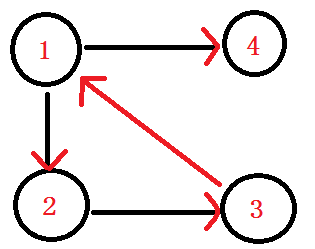

# [算法模版]Tarjan爷爷的两种图论算法

## 前言

Tarjan爷爷发明了很多图论算法，这些图论算法有很多相似之处（其中一个就是我都不会）。这里会对这三种算法进行简单介绍。

### 定义

**强连通(strongly connected)**： 在一个有向图$G$里，设两个点$ a, b $发现，由$a$有一条路可以走到$b$，由$b$又有一条路可以走到$a$，我们就叫这两个顶点$（a,b）$强连通。

**强连通图**： 如果 在一个有向图$G$中，每两个点都强连通，我们就叫这个图，强连通图。

**分量**：把一个向量分解成几个方向的向量的和，那些方向上的向量就叫做该向量（未分解前的向量）的分量。

**强连通分量(strongly connected components)**：在一个有向图G中，有一个子图，这个子图每2个点都满足强连通，我们就叫这个子图叫做强连通分量。

比如说这个图，在这个图中呢，点1与点2互相都有路径到达对方，所以它们强连通。

而在这个有向图中，点1 2 3组成的这个子图，是整个有向图中的强连通分量。

**dfn[i]**：指第$i$个点的$dfs$序。

**low[i]**：指第$i$个点的子树内的所有点通过反祖边能走到的点的$dfn$的最小值。

## Tarjan算法求割点/割边

## Tarjan算法求强连通分量

## 参考资料

[全网最!详!细!Tarjan算法讲解](https://blog.csdn.net/hurmishine/article/details/75248876)