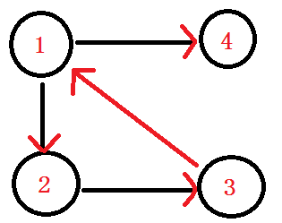

# [算法模版]Tarjan爷爷的两种图论算法

## 前言

Tarjan爷爷发明了很多图论算法，这些图论算法有很多相似之处（其中一个就是我都不会）。这里会对这三种算法进行简单介绍。

### 定义

**强连通(strongly connected)**： 在一个有向图$G$里，设两个点$ a, b $发现，由$a$有一条路可以走到$b$，由$b$又有一条路可以走到$a$，我们就叫这两个顶点$（a,b）$强连通。

**强连通图**： 如果 在一个有向图$G$中，每两个点都强连通，我们就叫这个图，强连通图。

**分量**：把一个向量分解成几个方向的向量的和，那些方向上的向量就叫做该向量（未分解前的向量）的分量。

**强连通分量(strongly connected components/SCC)**：在一个有向图G中，有一个子图，这个子图每2个点都满足强连通，我们就叫这个子图叫做强连通分量。



比如说这个图，在这个图中呢，点1与点2互相都有路径到达对方，所以它们强连通。

而在这个有向图中，点1 2 3组成的这个子图，是整个有向图中的强连通分量。

**dfn[i]**：指第$i$个点的$dfs$序。

**low[i]**：指第$i$个点的子树内的所有点通过反祖边能走到的点的$dfn$的最小值。

### 先行结论

- 在一个无向图上，跑一棵生成树。可以证明非树边只有反祖边，没有横叉边。

## Tarjan算法求割点/割边（针对无向图）

### 割点

首先，一个比较显然的结论就是所有的叶子结点和根节点都不是割点。对于其他节点`u`来说，只要有**至少一个**儿子`v`满足`low[u]>=dfn[v]`，就证明`v`若不通过他父亲就回不去。那这个点就是割点。根节点只需要判断是不是有两棵子树就好了。实现起来可以当作有两个点满足`low[u]>=dfn[b]`。因为因为根节点$dfn$为1，所以一定满足条件。如果两个根结点儿子不通过根节点就能联通，那么他们一定在一个子树。

```cpp
void tarjan(int now,int ff){
    low[now]=dfn[now]=++idx;
    for(int i=head[now];i;i=side[i].next){
        int v=side[i].v;
      	if(side[i].id==ff)continue;
        if(!dfn[v]){
            tarjan(v,side[i].id);
            low[now]=min(low[now],low[v]);
            if(low[v]>=dfn[now]){ans[now]++;}
        }
        else{
            low[now]=min(dfn[v],low[now]);
        }
    }
    return;
}
void output(){
	for(int i=1;i<=n;i++){
        if((ans[i]&&!root[i])||(ans[i]>=2&&root[i])){
            cout<<i<<' ';//输出所有割点
        }
    }
} 
```

### 割边

和割点基本一样。只需要把$low[v]>=dfn[u]$改成$low[v]>dfn[u]$即可。同时需要判断，不能再次走刚刚走过的边。

如果点`u`的至少一个儿子`v`满足`low[v]>dfn[u]`。就证明不通过这条边无法走到上面。所以这是条割边。

## Tarjan算法求点双/边双（针对无向图）

### 边双

和楼下的强连通分量很像，唯一的区别就是需要特殊判断一下，不能通过从父亲下来的那条边走上去。（因为强连通分量是有向图，走不上去，所以不存在这个问题）

另外，与割点不同，割边需要对每一条边都进行判断。

实现起来也很简单，只用简单修改一下dfs函数：

`dfs(u,f)`其中`u`为当前节点，`f`为走到这个点通过的边的编号。

当在遍历`u`的所有边试图向下dfs时，只需要加一个`if(现在准备选择的边的编号==f)continue;`即可。

### 点双

咕咕咕

## Tarjan算法求强连通分量（针对有向图）

需要注意的一点是，因为从一个点开始不一定能保证所有点都走得到，所以需要对每个没有$dfn$的点跑一遍$tarjan$。

```cpp
stack<int> tp;
void dfs(int u)
{
    dfn[u]=low[u]=++cnt1;//初始化每个未访问过的节点
    tp.push(u);
    for(int i=head[u];i;i=side[i].next)
    {
        int v=side[i].v;
        if(!dfn[v])dfs(v),low[u]=min(low[u],low[v]);
        else if(!scc[v])low[u]=min(low[u],dfn[v]);//被访问过却没有SCC编号（在栈里），证明在同一个强连通分量。因为栈维护的是一条有一个节点到它儿子的路径。所以如果栈顶的点u到栈中任意一点v有边。就证明存在u到v的一个环。
    }
    if(dfn[u]==low[u])//如果这个点是它所在强连通分量中dfn最小的，则有它来承担输出整个SCC的任务
    {
        int s=tp.top(),id=++cnt2;tp.pop();
        scc[s]=id;
        while(s!=u)s=tp.top(),tp.pop(),scc[s]=id;
    }
}
```

## 参考资料

[全网最!详!细!Tarjan算法讲解](https://blog.csdn.net/hurmishine/article/details/75248876)

[割点和桥](https://oi-wiki.org/graph/bridge/)