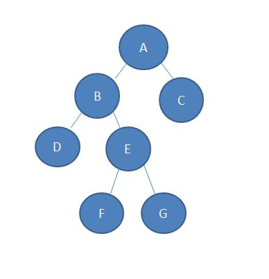
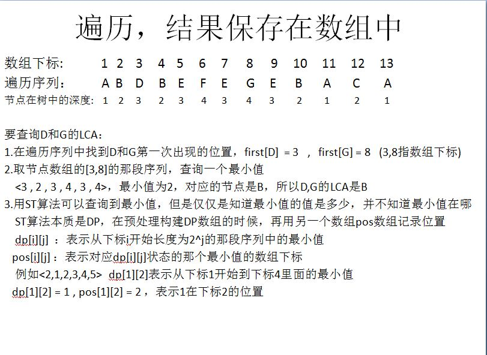
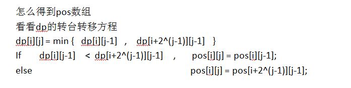
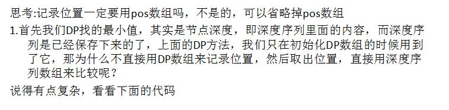
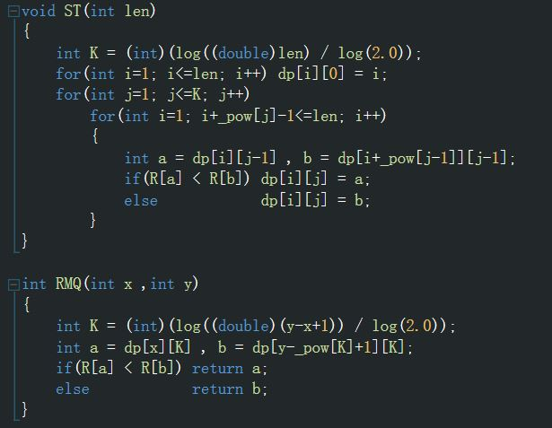

# [算法模版]树分治

## O(1)求LCA

在树分治中，很多时候需要高效的求解LCA。因此先介绍基于RMQ的O(1)求LCA。总的来说，是利用了一个性质：$E[LCA(u,v)]=min_{x\in [E[u],E[v]]}{height[x]}$。(两点的LCA为这两点欧拉序之间所有点中深度最小的点)

> **本部分摘自Titanium的博客，原文地址见文末**












## 点分治

贴个板子，没啥说的[BZOJ1316](https://vjudge.net/problem/HYSBZ-1316)。

```cpp
#include<iostream>
#include<cstdio>
#include<cstring>
#include<cmath>
#include<algorithm>
using namespace std;
const int maxn=10005;
const int inf=1e9;
int que[maxn],n,q,cnt,head[maxn],tot,siz[maxn],rt,mi,tp[maxn],dis[maxn],p,ans[maxn];
bool vis[maxn];
struct gg {
    int u,v,w,next;
}side[maxn*2];
void insert(int u,int v,int w) {
    side[++cnt]=(gg){u,v,w,head[u]};head[u]=cnt;
}
void getroot(int x,int fa) {
    int mx=0;siz[x]=1;
    for(int i=head[x];i;i=side[i].next) {
        int v=side[i].v;if(v==fa||vis[v])continue;
        getroot(v,x);siz[x]+=siz[v];mx=max(mx,siz[v]);
    }
    mx=max(mx,tot-siz[x]);
    if(mx<mi){mi=mx;rt=x;}
}
void dfs(int x,int fa) {
    tp[++p]=dis[x];
    for(int i=head[x];i;i=side[i].next) {
        int v=side[i].v;if(vis[v]||v==fa)continue;
        dis[v]=dis[x]+side[i].w;
        dfs(v,x);
    }
}
void calc(int x,int add,int val) {
    p=0;dis[x]=val;
    dfs(x,x);
    sort(tp+1,tp+1+p);tp[p+1]=inf;
    for(int i=1;i<=q;i++)
        for(int j=1;j<=p;j++)if((*lower_bound(tp+1,tp+1+p+1,que[i]-tp[j]))==que[i]-tp[j])ans[i]+=add;
}
void solve(int x) {
    calc(x,1,0);//???
    vis[x]=1;
    for(int i=head[x];i;i=side[i].next) {
        int v=side[i].v;if(vis[v])continue;
        calc(v,-1,side[i].w);
        mi=inf;tot=siz[v];
        getroot(v,x);
        solve(rt);
    }
}
int main() {
    scanf("%d%d",&n,&q);
    for(int i=1,u,v,w;i<n;i++){scanf("%d%d%d",&u,&v,&w);insert(u,v,w);insert(v,u,w);}
    for(int i=1;i<=q;i++)scanf("%d",&que[i]);
    tot=n;mi=1e9;
    getroot(1,0);
    solve(rt);
    for(int i=1;i<=q;i++)if(ans[i])printf("Yes\n");else printf("No\n");
    return 0;
}
```


## 参考资料

[Titanium](https://www.cnblogs.com/scau20110726/)