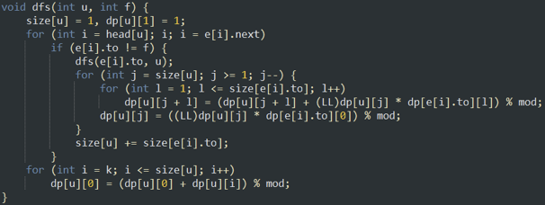

# [算法模版]树形背包

## 树形01背包

树形01背包和普通背包不同点在于物品之间有相互的依赖关系。选取儿子物品的必要条件是选取了所有他的祖先。

我们考虑使用`dp[i][j]`代表第`i`个点的子树内，花费了`j`个容量能得到的最大权值。

伪代码：

```cpp
for(int i=1;i<=son;i++){//枚举所有儿子
  dfs(son[i]);//先处理儿子
  for(int j1=m;j1>=0;j1--){//枚举当前点用掉了多少容量（正着枚举会变成完全背包）
    for(int j2=0;j2<=j1;j2++){//枚举这个儿子分配多少
      dp[i][j1]=max(dp[i][j1],dp[i][j1-j2]+dp[son[i]][j2]);//更新状态
    }
  }
}
```

显然，复杂度是$O(n*m^2)$的。

## 特殊情况的树形背包优化

当物品的体积全部为1时，我们可以把它优化到$O(n^2)$的复杂度。



[一道模版题](http://acm.hdu.edu.cn/showproblem.php?pid=1561)

## 参考资料

[树上背包的上下界优化](https://ouuan.github.io/%E6%A0%91%E4%B8%8A%E8%83%8C%E5%8C%85%E7%9A%84%E4%B8%8A%E4%B8%8B%E7%95%8C%E4%BC%98%E5%8C%96/)

[【算法讲堂】【电子科技大学】【ACM】树形背包问题](https://www.bilibili.com/video/av19615811/)

[将树形01背包优化到O(n*m)](https://blog.cyyself.name/2017/09/shu-xing-bei-bao-o-n-m/)