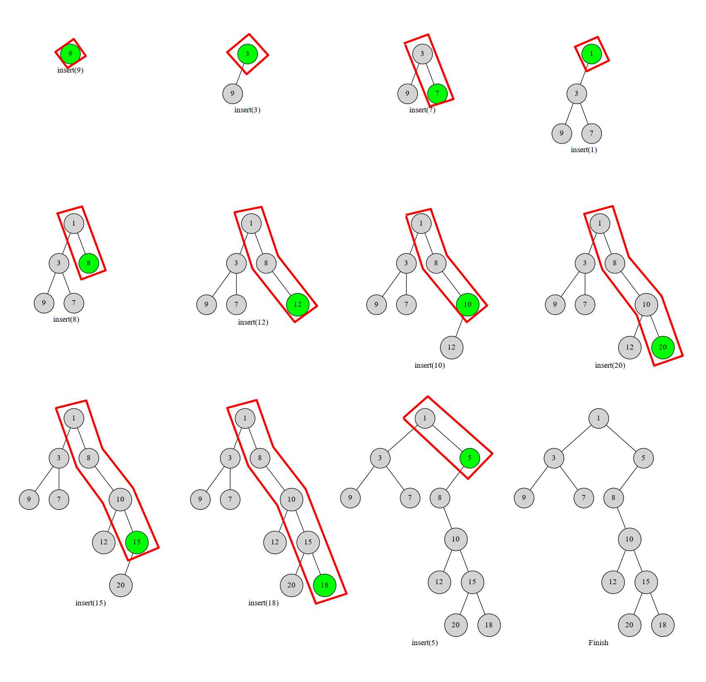

# [算法模版]笛卡尔树

**本文全文引自OI-WIKI 具体链接见文末**

本文介绍一种不太常用，但是与大家熟知的平衡树与堆密切相关的数据结构——笛卡尔树。

笛卡尔树是一种二叉树，每一个结点由一个键值二元组 $(k,w)$ 构成。要求 $k$ 满足二叉搜索树的性质，而 $w$ 满足堆的性质。一个有趣的事实是，如果笛卡尔树的 $k,w$ 键值确定，且 $k$ 互不相同， $w$ 互不相同，那么这个笛卡尔树的结构是唯一的。上图：


（图源自维基百科）

上面这棵笛卡尔树相当于把数组元素值当作键值 $w$ ，而把数组下标当作键值 $k$ 。显然可以发现，这棵树的键值 $k$ 满足二叉搜索树的性质，而键值 $w$ 满足小根堆的性质。

其实图中的笛卡尔树是一种特殊的情况，因为二元组的键值 $k$ 恰好对应数组下标，这种特殊的笛卡尔树有一个性质，就是一棵子树内的下标是连续的一个区间（这样才能满足二叉搜索树的性质）。更一般的情况则是任意二元组构建的笛卡尔树。

## 构建

## 栈构建

我们考虑将元素按照键值 $k$ 排序。然后一个一个插入到当前的笛卡尔树中。那么每次我们插入的元素必然在这个树的右链（右链：即从根结点一直往右子树走，经过的结点形成的链）的末端。于是我们执行这样一个过程，从下往上比较右链结点与当前结点 $u$ 的 $w$ ，如果找到了一个右链上的结点 $x$ 满足 $x_w<u_w$ ，就把 $u$ 接到 x 的右儿子上，而 x 原本的右子树就变成 u 的左子树。

具体不解释，我们直接上图。图中红色框框部分就是我们始终维护的右链：



显然每个数最多进出右链一次（或者说每个点在右链中存在的是一段连续的时间）。这个过程我们可以用栈维护，栈中维护当前笛卡尔树的右链上的结点。一个点不在右链上了就把它弹掉。这样每个点最多进出一次，复杂度 $O(n)$ 。伪代码如下：

```
新建一个大小为 n 的空栈。用 top 来标操作前的栈顶，k 来标记当前栈顶。
For i := 1 to n
    k := top
    While 栈非空 且 栈顶元素 > 当前元素 
        k--
    if 栈非空
        栈顶元素.右儿子 := 当前元素
    if k < top
        当前元素.左儿子 := 栈顶元素
    当前元素入栈
    top := k
```

## 参考资料

[笛卡尔树](https://oi-wiki.org/ds/cartesian-tree/)

 [维基百科 - 笛卡尔树](https://zh.wikipedia.org/wiki/%E7%AC%9B%E5%8D%A1%E5%B0%94%E6%A0%91) 