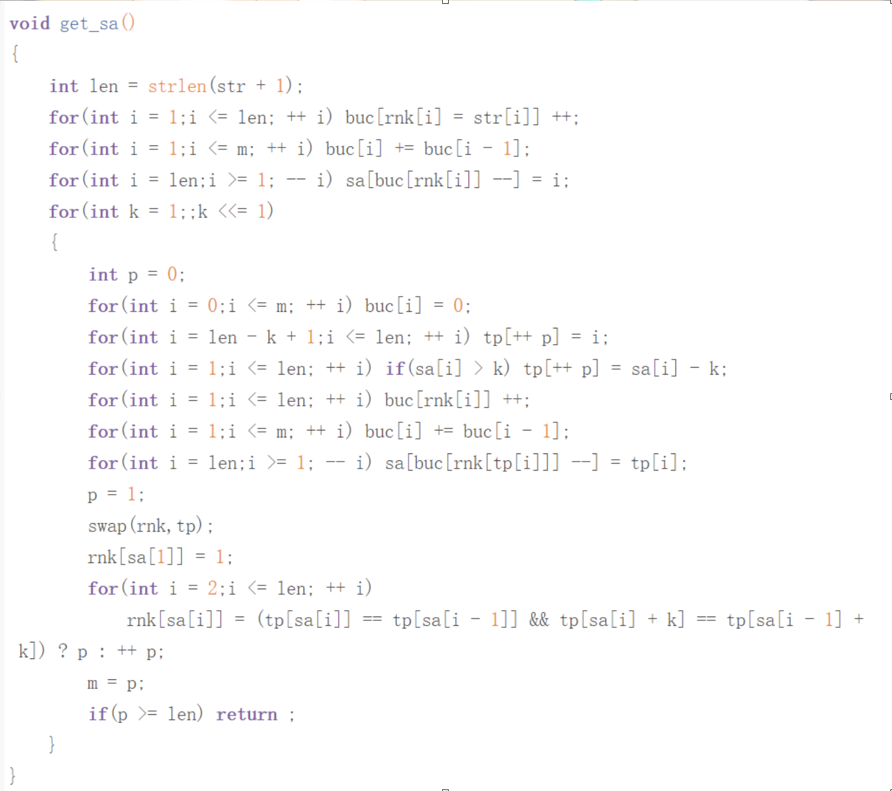

# [算法模版]后缀数组-SA

后缀数组的思想能在$O(n\log n)$的时间内把一个字符串的所有后缀进行后缀排序。

首先，我们定义一些东西：

$sa[i]$指现在第$i$名是以哪个位置开头的后缀

$rk[i]$以第$i$个位置开头的后缀是现在是第几名

$tp[i]$按照第二关键字排序第i名是谁

$buc[i]$放在前$i$个桶里(前$i$名)的元素个数

其中$sa$和$rk$数组是互相对应的。也就是说$sa[rk[i]]=rk[sa[i]]=i$。

一下是算法流程：

1. 首先我们先预处理出$rk$数组和$buc$数组（利用每个后缀第一个字母作为排序依据，名次=字母字典序）,只用$rk[i]=str[i]$就可以处理了，同时$buc[str[i]]++$。处理完之后对$buc$数组做一遍前缀和即可。
2. 我们再预处理出$sa$数组。因为第一步处理的$rk$数组并不是连续上升的，所以我们考虑将其“离散化”的版本赋给$sa$数组。具体操作就是从后往前枚举每个$i$，那么$i$的排名就是$buc[rk[i]]$，然后我们要把$buc[rk[i]]—$，防止下次再调用$buc[rk[i]]$的时候进行重复计算，得到相同排名。这一次得到的排名的第一关键字是第一个字母，第二关键字是位置
3. 然后我们开始倍增。定义倍增变量为$k$，每次将变量$k$左移一位。我们先把最后$k$位复制进$tp$数组。并按照先后顺序标记上编号。（因为长度不够，空格的字典序在最前面）
4. 随后，我们从小到大依次遍历$sa$数组，我们发现对于一个从$i$开始的后缀，***我们找到比他多k位的后缀***（记为j）,那么i的第一关键字($[1,k]$)就是j的第二关键字（$[k+1,2k]$）。因为我们是按照排名从小到大遍历所以$i$的排名（第一关键字）就是$j$的第二关键字。
5. 我们再用一次初始化的方法更新$sa$数组，只不过这一次的第二关键字不是按照位置，而是根据刚刚求出来的$tp$数组。

贴个wkr大佬的代码：

