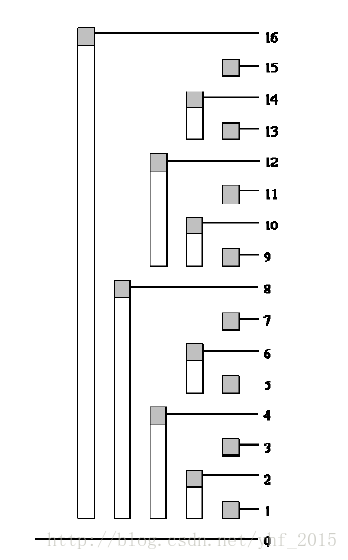

# [算法模板]树状数组

## 思路



图片转自：[yhf_2015——彻底理解树状数组](<https://blog.csdn.net/yhf_2015/article/details/53844284>)

使用这个图片就能很快的理解树状数组。

我们可以先根据图片来分解一个十进制数成二次幂。

example: 

$15=2^0+14$

$14=2^1+12$

$12=2^2+8$

$8=2^3$

$15=2^0+2^1+2^2+2^3$

图上的每一个白条（包含灰块）就是$c[i]$覆盖的范围，而$lowbit(i)$就是灰块对应的白条的长度。

example：

$c[12]= \sum _{i=9}^{12} a[i]$

$lowbit(12)=4$

显然，加上lowbit就可以达到覆盖自己的白条（父节点）。减去lowbit就下一个**当前灰块对应白条不包含的，离当前灰块最近的白条。**(14->12,12->8,8->0)

## 实现

总结一下，原数组a和树状数组c大小相等。每个节点的父亲节点为$x+lowbit(x)$。

修改操作，每次修改给当前位置的c加上权值d。位置p加上lowbit(p)，位置$p\leq n$。

求和操作，每次累加当前位置的c权值。位置p减去lowbit(c)，位置$1 \leq p$。


```cpp
int lowbit(int x)
{
    return x&(-x);
}
int sum(int x)//查询1-x的值
{
    int ret=0;
    while(x)
    {
        ret+=c[x];
        x-=lowbit(x);
    }
    return ret;
}
void update(int x,int d)//将x的值加上d
{
    while(x<=n)
    {
        c[x]+=d;
        x+=lowbit(x);
    }
}
```

