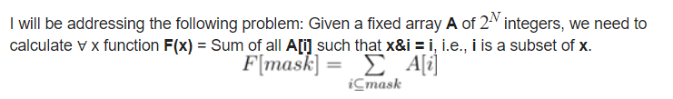

# CF1208F Bits And Pieces

[传送门](https://codeforces.com/contest/1208/problem/F)

这里要运用SOS-DP的思路（$\text{Sum over Subsets}$）。

SOS-DP是用来解决这样的问题的：

## 引用资料

[SOS Dynamic Programming [Tutorial]](https://codeforces.com/blog/entry/45223)

