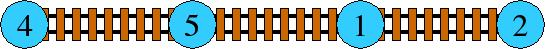
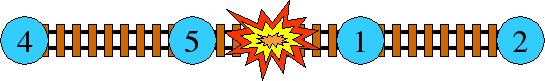
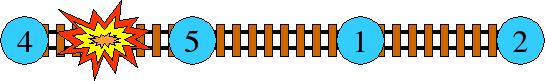

# [HDU2829]Lawrence

## 题面

  T. E. Lawrence was a controversial figure during World War I. He was a British officer who served in the Arabian theater and led a group of Arab nationals in guerilla strikes against the Ottoman Empire. His primary targets were the railroads. A highly fictionalized version of his exploits was presented in the blockbuster movie, "Lawrence of Arabia".

You are to write a program to help Lawrence figure out how to best use his limited resources. You have some information from British Intelligence. First, the rail line is completely linear---there are no branches, no spurs. Next, British Intelligence has assigned a Strategic Importance to each depot---an integer from 1 to 100. A depot is of no use on its own, it only has value if it is connected to other depots. The Strategic Value of the entire railroad is calculated by adding up the products of the Strategic Values for every pair of depots that are connected, directly or indirectly, by the rail line. Consider this railroad:    



Its Strategic Value is 4*5 + 4*1 + 4*2 + 5*1 + 5*2 + 1*2 = 49.

Now, suppose that Lawrence only has enough resources for one attack. He cannot attack the depots themselves---they are too well defended. He must attack the rail line between depots, in the middle of the desert. Consider what would happen if Lawrence attacked this rail line right in the middle:  



The Strategic Value of the remaining railroad is 4*5 + 1*2 = 22. But, suppose Lawrence attacks between the 4 and 5 depots: 




The Strategic Value of the remaining railroad is 5*1 + 5*2 + 1*2 = 17. This is Lawrence's best option.

Given a description of a railroad and the number of attacks that Lawrence can perform, figure out the smallest Strategic Value that he can achieve for that railroad.   

## 思路

首先，我们可以很快的写出状态转移方程：$f[i][t]=min(f[j][t-1]+w[j+1][i],1\leq j<i)$。其中i为当前处理的车站，t为已经使用的攻击次数，w为任意一个子段的答案。

考虑变形w：$w[j+1][i]=w[1][i]-w[1][j]-sum[j]\times(sum[i]-sum[j])$

将其带入方程：

$f[i][t]=max(f[j][t-1]+w[1][i]-w[1][j]+sum[j]^2-sum[j]sum[i]),1\leq j <i$

其中$k=-sum[j],x=sum[i],b=f[j][t-1]+w[1][i]-w[1][j]+sum[j]^2$其中w因为都是一维，可以直接预处理。

## 代码

```cpp
#include<iostream>
#include<cstdio>
#include<algorithm>
#include<cstring>
using namespace std;
#define maxn 1050
#define ll long long
struct line{
	ll k,b;
}l[maxn];
ll w[maxn],f[maxn][maxn],sum[maxn];
int n,m,a[maxn];
void init(){
	for(int i=1;i<=n;i++)scanf("%d",&a[i]);
	for(int i=1;i<=n;i++)sum[i]=sum[i-1]+a[i];
	for(int i=1;i<=n;i++)w[i]=w[i-1]+sum[i-1]*a[i];
	for(int i=1;i<=n;i++)f[i][0]=w[i];
	return;
}
bool calc(line l1,line l2,ll c){return (double)(l1.b-l2.b)/(l2.k-l1.k)<=c;}
bool calc(line l1,line l2,line l3){return (double)(l1.b-l2.b)/(l2.k-l1.k)>=(l1.b-l3.b)/(l3.k-l1.k);}
void solve(){
	init();
	for(int t=1;t<=m;t++){
		int head=1,tail=0;
		l[++tail]=(line){0,0};//
		for(int i=1;i<=n;i++){
			while(head<tail&&calc(l[head],l[head+1],sum[i]))head++;
			f[i][t]=l[head].k*sum[i]+l[head].b+w[i];
			if(sum[i]==sum[i-1])continue;
			line now=(line){-sum[i],f[i][t-1]-w[i]+sum[i]*sum[i]};
			while(head<tail&&calc(l[tail],l[tail-1],now))tail--;
			l[++tail]=now;
		}
	}
	printf("%lld\n",f[n][m]);
}
int main(){
	//freopen("in","r",stdin);
	while(~scanf("%d%d",&n,&m)){if(n||m)solve();}
	return 0;
}
```

