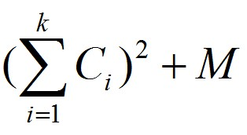

# [HDU3507]Print Article

## 题面

Zero has an old printer that doesn't work well sometimes. As it is antique, he still like to use it to print articles. But it is too old to work for a long time and it will certainly wear and tear, so Zero use a cost to evaluate this degree. 
One day Zero want to print an article which has N words, and each word i has a cost Ci to be printed. Also, Zero know that print k words in one line will cost 



M is a const number. 
Now Zero want to know the minimum cost in order to arrange the article perfectly. 

### Input

There are many test cases. For each test case, There are two numbers N and M in the first line (0 ≤ n ≤ 500000, 0 ≤ M ≤ 1000). Then, there are N numbers in the next 2 to N + 1 lines. Input are terminated by EOF.

### Output

A single number, meaning the mininum cost to print the article.

### Sample Input

```
5 5
5
9
5
7
5
```

### Sample Output

```
230
```

## 思路

这是一道斜率优化dp的经典例题。

很显然，我们可以得出状态转移方程：

$$f[i]=min(f[j]+(s[i]-s[j])^2+M),1\leq j< i$$

化简一波可以得到：

$f[i]=min(f[j]+s[j]^2-2s[i]s[j])+M+s[i]^2$

那么，我们令$k=-2s[j],x=s[i],b=f[j]+s[j]^2,y=kx+b$

那么对于直线$x=s[i]$，与任意直线$y=kx+b,k=-2s[j]$的交点(s[i],h)，h就意味着$min(f[j]+s[j]^2-2s[i]s[j])$的值。

显然，对于第$i$次转移，我们可以把$[1,i-1]$次转移时的$min(f[j]+s[j]^2-2s[i]s[j])$看成$i-1$条线段，然后在$s[i]$的位置作一条垂直于$x$轴的直线，与之交点最低的那条直线对应的编号就是最优的转移对象。

我们可以维护一个上凸壳，每次加入的直线（对于每个i，转移完成后就会变成直线加入）后先判断$i和i-1$以及$i-1和i-2$这两条直线交点横坐标的大小关系。如果前者小于后者，很显然$i-1$这条线就没用了。

## 代码

```cpp
#include<iostream>
#include<cstdio>
#include<algorithm>
#include<cmath>
using namespace std;
#define maxn (int)(5e5+100)
#define ll long long
struct gg{
	ll b,k;
}l[maxn];
int head,tail,c[maxn],n,m;
ll s[maxn],f[maxn];
bool cmp(gg l1,gg l2,int c){return (double)(l2.b-l1.b)/(l1.k-l2.k)<=c;}
bool cmp(gg l1,gg l2,gg c){return
	(double)(l2.b-l1.b)/(l1.k-l2.k)>=(double)(c.b-l1.b)/(l1.k-c.k);}
ll solve(){
	head=1,tail=0,l[++tail]=(gg){0,0};
	for(int i=1;i<=n;i++){
		s[i]=s[i-1]+c[i];
		while(head<tail&&cmp(l[head],l[head+1],s[i]))head++;
		f[i]=l[head].b+l[head].k*s[i]+s[i]*s[i]+m;
		if(s[i]==s[i-1])continue;
		gg now=(gg){f[i]+s[i]*s[i],-2*s[i]};
		while(head<tail&&cmp(l[tail-1],l[tail],now))tail--;
		l[++tail]=now;
	}
	return f[n];
}
int main(){
	while(~scanf("%d%d",&n,&m)){
		for(int i=1;i<=n;i++)scanf("%d",&c[i]);
		printf("%lld\n",solve());
	}
}
```

